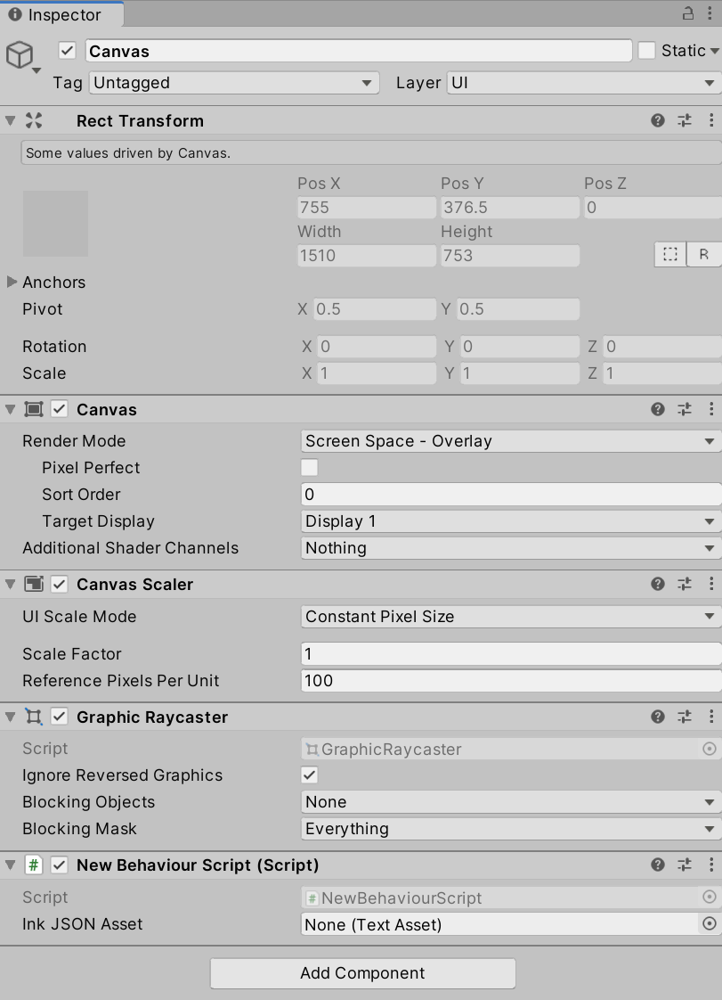
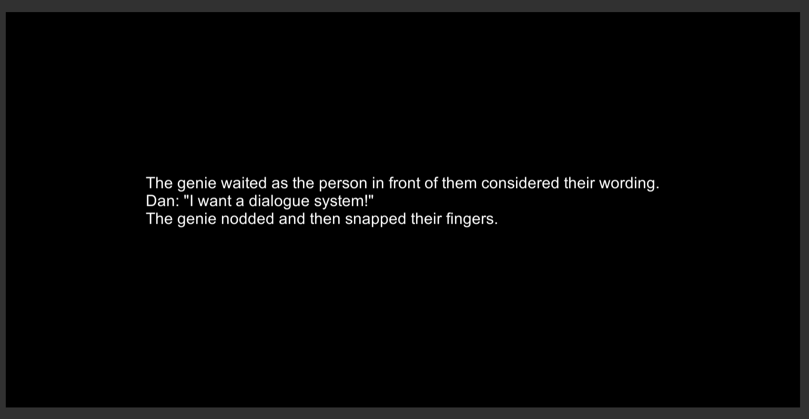

Table of Contents:

- [Adding GameObjects](#adding-gameobjects)
  - [Adding **Text**](#adding-text)
  - [Removing Scripting Components](#removing-scripting-components)
  - [Attaching Existing Scripting Components](#attaching-existing-scripting-components)
- [Working With **Canvas** and **Text**](#working-with-canvas-and-text)
  - [Using **GetComponentInChildren\<GameObject\>()**](#using-getcomponentinchildrengameobject)
  - [Adjusting **Text** Properties](#adjusting-text-properties)
  - [Working with Layouts](#working-with-layouts)

## Adding GameObjects

Previously in this book, the method **Debug.Log()** has been used to show text content in the Console window. While useful for debugging and testing, the method does not show text within the Scene or Game Views. For that, new GameObjects are needed.

> **Note:** As of 2025, Unity provides two main UI systems:
>
> - **Unity UI (uGUI)**: The built-in UI system covered in this chapter, suitable for most game UI needs
> - **TextMeshPro**: A more advanced text rendering solution with better quality and features, recommended for professional projects
> - **UI Toolkit**: Unity's newer UI framework for editor and runtime UI (more complex, primarily for tools)
>
> This chapter covers Unity UI (uGUI) as it's the most straightforward for beginners. For production projects, consider using TextMeshPro for superior text rendering quality.

### Adding **Text**


Using either the Add menu or right-clicking, go to UI -> Text. This will add a new **Text** GameObject to the Scene.


The **Text** GameObject cannot be shown by itself, so Unity also adds a **Canvas** GameObject and a GameObject called **EventSystem**. A **Canvas** GameObject represents the abstract space of user interface GameObjects. It serves as both collection and to define of the bounds of the screen. GameObjects within the category of User Interface (UI) also expect some form of user interaction, so the **EventSystem** is added to help with those events.

### Removing Scripting Components

In previous examples in this book, a Scripting Component was added to the **Main Camera** GameObject to demonstrate various functionality and how to use the Story API. That is no longer needed, so that component can be removed from the **Main Camera**.


Through clicking on the **Main Camera**, it components will be listed in the Inspector Window. Clicking on the extended settings (three dots) of the component and then clicking "Remove Component" will remove the component from the **Main Camera**.

> **Reminder:** Removing a component from a GameObject does not delete any assets associated with that component. They remain part of the Project and can be used with other components.

### Attaching Existing Scripting Components

With the Scripting Component now removed from the **Main Camera**, the existing `NewBehaviourScript.cs` file will no longer be active and run in the Scene.

Previously, it made sense to use the **Main Camera**, as it was the only component in the Scene. However, with **Canvas** and **Text** objects, a new component can be added. Considering that the **Text** GameObject is a child of the parent **Canvas** GameObject, it now makes sense to create a Scripting Component on this GameObject.

However, instead of creating a new Scripting Component, the existing C\# file can be dragged and dropped from the Project window into the existing components of the **Canvas** GameObject in its Inspector Window. While the **Canvas** GameObject is selected, dropping the `NewBehaviourScript.cs` file will create a new Scripting Component and associated the file with the component.



As was done in previous chapters, the compiled Ink (JSON) file now needs to be re-associated with the Scripting Component. Like was done previously, dragging and dropping the file will associate it with the "Ink JSON Asset" property.


While included in previous chapters, the contents of the `NewBehaviourScript.cs` file is included below:

**NewBehaviourScript.cs:**

```CSharp
using System.Collections;
using System.Collections.Generic;
using UnityEngine;
// Add the Ink Runtime
using Ink.Runtime;

public class NewBehaviourScript : MonoBehaviour
{
    // Add a TextAsset representing the compiled Ink Asset
    public TextAsset InkJSONAsset;

    // Start is called before the first frame update
    void Start()
    {
        // Create a new Story object using the compiled (JSON) Ink story text
        Story exampleStory = new Story(InkJSONAsset.text);

        // Each loop, check if there is more story to load
        while (exampleStory.canContinue)
        {
            // Load the next story chunk and return the current text
            string currentTextChunk = exampleStory.Continue();

            // Get any tags loaded in the current story chunk
            List<string> currentTags = exampleStory.currentTags;

            // Create a blank line of dialogue
            string line = "";

            // For each tag in currentTag, set its values to the new variable 'tag'
            foreach (string tag in currentTags)
            {
                // Concatenate the tag and a colon
                line += tag + ": ";
            }

            // Concatenate the current text chunk
            // (This will either have a tag before it or be by itself.)
            line += currentTextChunk;

            // Print the current line using the combined string
            //  created from the current tag and story chunk.
            Debug.Log(line);
        }
    }
}
```

**New Ink.ink:**

```ink
The genie waited as the person in front of them considered their wording.

"I want a dialogue system!" #Dan

The genie nodded and then snapped their fingers.
```

## Working With **Canvas** and **Text**

With the new scripting component added, running the Scene will produce the same results in the Console as was previously shown when using the **Main Camera** in previous chapters.


However, the contents of the Game View has changed. With a user interface GameObject added, it now shows the *text* content of the **Text** GameObject: "New Text."


In the lower, left-hand corner is the black "New Text" on a blue background. While hard to see, it shows that the **Text** GameObject is now being rendered.

> **Note:** The legacy **Text** component shown here has been largely superseded by **TextMeshPro - Text (UI)** in modern Unity projects. TextMeshPro provides better text quality, more formatting options, and improved performance. To use TextMeshPro instead:
>
> 1. Go to **GameObject → UI → Text - TextMeshPro** (this will prompt to import TMP Essentials)
> 2. Import TMP Essentials when prompted
> 3. Use `using TMPro;` instead of `using UnityEngine.UI;`
> 4. Use `TMP_Text` or `TextMeshProUGUI` instead of `Text` in your scripts
>
> For this tutorial, we'll continue with the legacy Text component for simplicity, but consider using TextMeshPro for your own projects.

### Using **GetComponentInChildren\<GameObject\>()**

Opening `NewBehaviourScript.cs` in your code editor allows for changing its contents.

> **Reminder:** Double-clicking on a C\# file in the Project window will open it in your configured code editor (Visual Studio, Visual Studio Code, or Rider).

Because the script will now be accessing and working with UI elements, an additional library is needed in the script. Along with its existing libraries, it also needs the namespace **UnityEngine.UI**.

```CSharp
using System.Collections;
using System.Collections.Generic;
using UnityEngine;
// Add the Ink Runtime
using Ink.Runtime;
// Add Unity UI
using UnityEngine.UI;
```

> **Note:** The [namespace **UnityEngine.UI**](https://docs.unity3d.com/Packages/com.unity.ugui@1.0/api/UnityEngine.UI.html) contains the classes for working with user interface objects like **Text**

Within the existing code, two new lines are needed. The first will access the child **Text** GameObject and the second will change its content. Instead of showing "New Text", it will be set to whatever is generated from the Ink Story API.

In order to do this, the [method **GetComponentInChildren\<GameObject\>()**](https://docs.unity3d.com/ScriptReference/Component.GetComponentInChildren.html) is used. This accesses the components of the current GameObject (in this case **Canvas**) and all of its children. It looks for the type supplied. Since the type to look for is "Text", this is supplied instead of "GameObject".

```CSharp
// From this GameObject, look in its children for a component of the type "Text".
// Return a reference to this component and save it locally.
Text childText = GetComponentInChildren<Text>();
```

With the namespace **UnityEngine.UI**, the class **Text** can be used. Paired with the method **GetComponentInChildren\<Text\>()** looking for the type "Text", the child component of **Canvas**, **Text**, can be found and a reference to it saved locally. This will allow for the second step, editing its content.

All **Text** objects have [a property named *text*](https://docs.unity3d.com/Packages/com.unity.ugui@1.0/api/UnityEngine.UI.Text.html#UnityEngine_UI_Text_text) that exposes their **string** content.

```CSharp
// Edit the 'text' property to change its content
childText.text = "Testing";
```

Placed in the larger context of the existing Ink Story API code, the two above lines would replace the previously used **Debug.Log()** as the last lines inside of the outer `while()` loop.

**NewBehaviourScript.cs:**

```CSharp
using System.Collections;
using System.Collections.Generic;
using UnityEngine;
// Add the Ink Runtime
using Ink.Runtime;
// Add Unity UI
using UnityEngine.UI;

public class NewBehaviourScript : MonoBehaviour
{
    // Add a TextAsset representing the compiled Ink Asset
    [SerializeField] private TextAsset inkJSONAsset;

    // Start is called before the first frame update
    void Start()
    {
        // Create a new Story object using the compiled (JSON) Ink story text
        Story exampleStory = new Story(inkJSONAsset.text);

        // Each loop, check if there is more story to load
        while (exampleStory.canContinue)
        {
            // Load the next story chunk and return the current text
            string currentTextChunk = exampleStory.Continue();

            // Get any tags loaded in the current story chunk
            List<string> currentTags = exampleStory.currentTags;

            // Create a blank line of dialogue
            string line = "";

            // For each tag in currentTag, set its values to the new variable 'tag'
            foreach (string tag in currentTags)
            {
                // Concatenate the tag and a colon
                line += tag + ": ";
            }

            // Concatenate the current text chunk
            // (This will either have a tag before it or be by itself.)
            line += currentTextChunk;

            // From this GameObject, look in its children for a component of the type "Text".
            // Return a reference to this component and save it locally.
            Text childText = GetComponentInChildren<Text>();
            // Edit the 'text' property to change its content
            childText.text = "Testing";
        }
    }
}
```


Now, in the updated code, the previous **Text** content of "New Text" is replaced when the Scene is run with the text of "Testing". This shows that the method **GetComponentInChildren\<Text\>()** is working correctly and that the content of the child GameObject can be changed.

The property *text* is a **string**. This means, like with *line* in the existing code, its contents can also be concatenated as well. Instead of showing "Testing", the content of each *line* can be added to the existing *text* and shown on the screen when the Scene is run.

However, while the previous location of the two added lines showed how the content of a **Text** child GameObject could be accessed and changed, they do not need to be part of the loop. They can be set initially and then the concatenation process can work inside of the outer loop.

**NewBehaviourScript.cs:**

```CSharp
using System.Collections;
using System.Collections.Generic;
using UnityEngine;
// Add the Ink Runtime
using Ink.Runtime;
// Add Unity UI
using UnityEngine.UI;

public class NewBehaviourScript : MonoBehaviour
{
    // Add a TextAsset representing the compiled Ink Asset
    [SerializeField] private TextAsset inkJSONAsset;

    // Start is called before the first frame update
    void Start()
    {
        // Create a new Story object using the compiled (JSON) Ink story text
        Story exampleStory = new Story(inkJSONAsset.text);

        // From this GameObject, look in its children for a component of the type "Text".
        // Return a reference to this component and save it locally.
        Text childText = GetComponentInChildren<Text>();

        // Reset the existing text of "New Text" to an empty string
        childText.text = "";

        // Each loop, check if there is more story to load
        while (exampleStory.canContinue)
        {
            // Load the next story chunk and return the current text
            string currentTextChunk = exampleStory.Continue();

            // Get any tags loaded in the current story chunk
            List<string> currentTags = exampleStory.currentTags;

            // Create a blank line of dialogue
            string line = "";

            // For each tag in currentTag, set its values to the new variable 'tag'
            foreach (string tag in currentTags)
            {
                // Concatenate the tag and a colon
                line += tag + ": ";
            }

            // Concatenate the current text chunk
            // (This will either have a tag before it or be by itself.)
            line += currentTextChunk;

            // Concatenate the content of 'line' to the existing text
            childText.text += line;
        }
    }
}
```


With the new code, the first line of the Ink file is shown before it is cut off. While not ideal, it shows that all of the Ink Story API and child GameObject code is working. It is time to adjust the properties of the **Text** GameObject itself.

### Adjusting **Text** Properties

Given that the text is being cut off, an immediate solution may seem to increase the width of **Text**.


After all, given its current size of 160, that does seem like a valid solution to the problem. Changing it to, say, 500 or 600 seems like a better size.

> **Reminder:** The values of properties can be changed while a Scene is running. This is often a good way to test values and see their results. Any changes made while the Scene is running **will not be saved**.


Adjusting the width will not have the desired affect.


As can be seen when adjusting the value, the width of the text would increase, but its position remains the same, relative to the **Canvas**. The problem is not with **Text**, but with its parent.

### Working with Layouts

The **Canvas** GameObject is both a collection and an abstraction of the user interface space it contains. To help in organizing UI GameObjects, **Canvas** has access to Layouts. These are ways to automatically arrange other, child GameObjects that are a part of **Canvas** GameObjects.


Layout components can be added to a **Canvas** GameObject through viewing its Inspector Window, clicking on "Add Component" and going to "Layout".


While there are several options, a Vertical Layout Group is a good solution to organizing multiple UI GameObjects within a **Canvas**. It allows for setting equal spacing and will help with eventually adding more UI GameObjects for interacting with choices later as well.


Generally, setting Control Child Size and Use Child Scale for both Width and Height are worth checking. This will allow the layout to enforce the size of the child GameObjects and will scale them to match the **Canvas**.


Now, when the Scene is run, the content of the **Text** will appear in the upper left corner and will be scaled to match the greater **Canvas** parent.

In fact, through adjusting the Child Alignment menu from "Upper Left" to "Middle Center" within the Layout settings, the text will also move to the center.


At this point, the layout is handling the positioning of the text and will scale it to match the parent **Canvas**. However, it is still small and hard to read. To fix that, it is time to return to the properties of the **Text** itself.


Selecting **Text** from the Hierarchy Window will open it in the Inspector Window.


> **Reminder:** Different font sizes and options can be tried through playing the Scene and adjusting the values during runtime.

A good general font size is 30 for higher resolutions.


To adjust the color of the **Text** content, click on "Color" and choose something in higher contrast to the existing blue like white.


Finally, to adjust the default blue background, click on **Main Camera** in the Hierarchy Window. In its Inspector Window, click on its "Background" property and adjust the color to a darker one.


With the **Text** color set to a lighter one and the **Main Camera** background color set to a darker one, the now centered text is far more readable.


