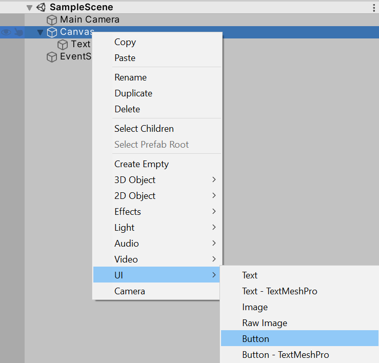
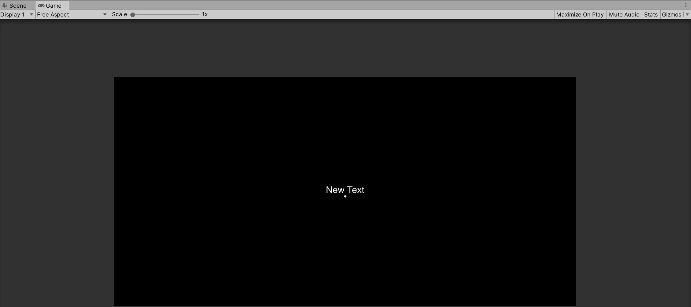
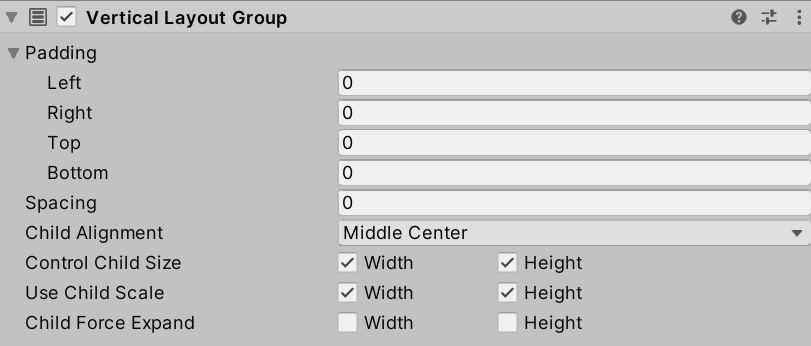
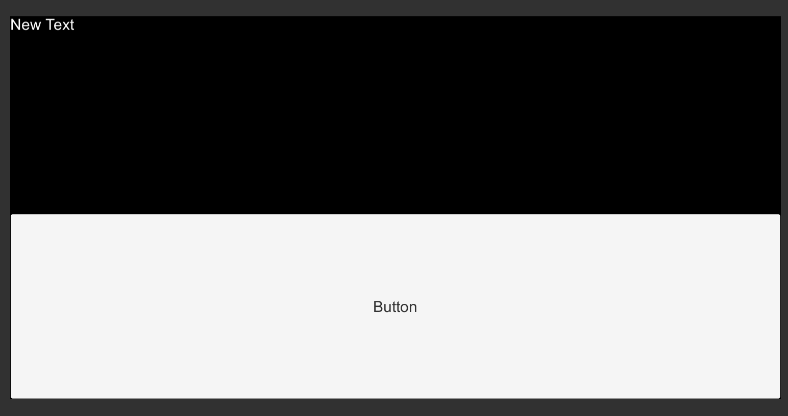
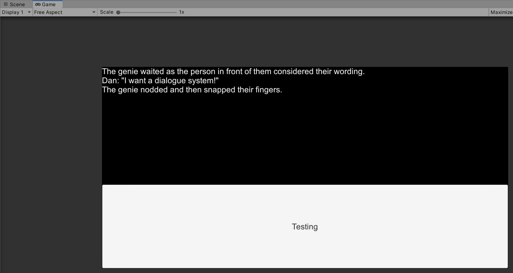
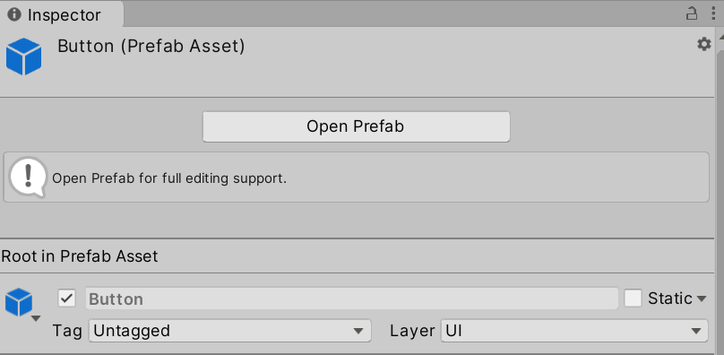
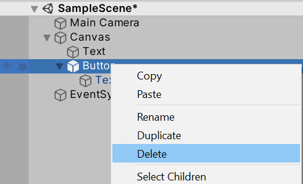

Table of Contents:

- [Working with Buttons](#working-with-buttons)
  - [Forcing Child Expansion](#forcing-child-expansion)
  - [Parsing Choices into Buttons](#parsing-choices-into-buttons)
- [Creating Prefabs](#creating-prefabs)
  - [Creating a Button Prefab](#creating-a-button-prefab)
  - [Dynamically Creating Buttons](#dynamically-creating-buttons)

## Working with Buttons

The **Button** is a fundamental user interface element. It is something a user can click on that should produce some effect.

> **Note:** As of 2025, while Unity UI (uGUI) buttons remain widely used, consider using **TextMeshPro - Button** for better text rendering quality. The concepts in this chapter apply to both, but TextMeshPro provides superior text display and more formatting options.



Based on the GameObject created previously in this book, adding a new **Button** GameObject to the existing **Canvas** is possible through right-clicking on it, going to UI, and then clicking on Button. This will add a **Button** as a child of **Canvas**.


Once added, the new **Button** will be child of the **Canvas** and also have its own child: another **Text**. This is because the **Button** is only that, a button. The text component of the **Button** is actually another **Text**.



When viewed on the Game View, the existing **Text** (with its *text* of "New Text") and the button will be arranged vertically (due to the use of the Vertical Layout Group added in the previous chapter). However, when viewed, the **Button** is small compared to the existing content of the **Canvas**.

### Forcing Child Expansion



In the previous chapter, the option Child Force Expand was left unchecked in the Vertical Layout Group Properties. While this worked with the sole child of **Text**, with the additional child GameObject of **Button**, it now needs to be used to force all children to expand within the **Canvas**.

> **Reminder:** Clicking on a component in the Hierarchy Window lists its components in the Inspector Window. Clicking on **Canvas** allows for accessing its components and the properties of the Vertical Layout Group.


The result of forcing the child GameObjects to expand can be seen in the Game View.



With the new option checked, all of the child GameObjects are forced to expand to fill the available space of the **Canvas**.

While not ideal, the new arrangement of GameObjects is a good place to stop and return to C\# code in order to start processing **Choice** objects and using their *text* properties to change the *text* of the **Text** child of the **Button**.

### Parsing Choices into Buttons

Based on what was introduced in a previous chapter, the [method **GetComponentInChildren\<T\>()**](https://docs.unity3d.com/ScriptReference/Component.GetComponentInChildren.html) can be used to search for a child component starting from a parent GameObject. In the case of **Canvas**, because the added **Button** is now a child of it, the method can be used again. This time, instead of searching for **Text**, it can be used to find the added **Button**.

> **Note:** As of 2025, it's recommended to use specific type parameters with generic methods. The syntax `GetComponentInChildren<Button>()` is preferred over the older `GetComponentInChildren<GameObject>()` pattern.

```CSharp
// From this GameObject, look in its children for a component of the type "Button".
// Return a reference to this component and save it locally.
Button childButton = GetComponentInChildren<Button>();
```

This time, unlike in the previous chapter with using the now saved component, an additional search is needed to find the **Text** child of the found **Button**.

```CSharp
// From this GameObject, look in its children for a component of the type "Button".
// Return a reference to this component and save it locally.
Button childButton = GetComponentInChildren<Button>();

// From this GameObject, look in its children for a component of the type "Text".
// Return a reference to this component and save it locally.
Text buttonText = childButton.GetComponentInChildren<Text>();
```

> **Note:** The method `GetComponentInChildren<T>()` returns the *first* component it finds of the specified type. When searching from **Canvas**, this finds its child **Text** first. When searching from **Button**, this finds *its* **Text** component first.

Finally, to demonstrate the editing of its *text* property, the following line is added:

```CSharp
// Change the text
buttonText.text = "Testing";
```

Put all together with the existing code developed in the previous chapter, it would be the following:

**NewBehaviourScript.cs:**

```CSharp
using System.Collections;
using System.Collections.Generic;
using UnityEngine;
// Add the Ink Runtime
using Ink.Runtime;
// Add Unity UI
using UnityEngine.UI;

public class NewBehaviourScript : MonoBehaviour
{
    // Add a TextAsset representing the compiled Ink Asset
    [SerializeField] private TextAsset inkJSONAsset;
    
    // Add a Button Prefab
    [SerializeField] private Button buttonPrefab;
    
    // Private Story object
    private Story exampleStory;
    
    // Private Text reference
    private Text childText;
    
    // Start is called before the first frame update
    void Start()
    {
        // Create a new Story object using the compiled (JSON) Ink story text
        exampleStory = new Story(inkJSONAsset.text);
        
        // From this GameObject, look in its children for a component of the type "Text".
        childText = GetComponentInChildren<Text>();
        
        // Reset the existing text
        childText.text = "";
        
        // From this GameObject, look in its children for a component of the type "Button".
        Button childButton = GetComponentInChildren<Button>();
        
        // From the Button, get its Text child
        Text buttonText = childButton.GetComponentInChildren<Text>();
        
        // Change the text
        buttonText.text = "Testing";
    /* Lines 101-153 omitted */
    }
}
```

When run, the *text* of the child GameObject of **Button** will be overwritten.



With this in place, it is time to change the existing Ink story from the previous chapters and re-introduce the code to parse **Choice** objects.

**New Ink.ink:**

```ink
The door opens upon a darkly-lit attic.

* [Proceed?]
-

You cautiously walk forward, noting the dust coating everything around you. Looking down, you even seen your own footprints in the dust from the door.
```

In the new Ink code, there is a choice with selected output. (This means the words in the choice will not appear in the output.) It is also using a gathering point, `-`, that will gather the story back into the point after the set of choices instead of branching it.

To parse the new choice in the Ink story, the inner loop code developed in previous chapters can be used again.

```CSharp
// For each choice in currentChoices, set its values to the new variable 'choice'
foreach (Choice choice in exampleStory.currentChoices)
{
}
```

This time, instead of using **Debug.Log()**, the *text* of the **choice** will be used to overwrite the *text* of the **Button**'s **Text**.

```CSharp
// For each choice in currentChoices, set its values to the new variable 'choice'
foreach (Choice choice in exampleStory.currentChoices)
{
    // Set the button's text to the choice's text
    buttonText.text = choice.text;
}
```

Put at the end of the previous code inside of the `while()` loop, it would look like the following:

**NewBehaviourScript.cs:**

```CSharp
using System.Collections;
using System.Collections.Generic;
using UnityEngine;
// Add the Ink Runtime
using Ink.Runtime;
// Add Unity UI
using UnityEngine.UI;

public class NewBehaviourScript : MonoBehaviour
{
    // Add a TextAsset representing the compiled Ink Asset
    [SerializeField] private TextAsset inkJSONAsset;

    // Start is called before the first frame update
    void Start()
    {
        // Create a new Story object using the compiled (JSON) Ink story text
        Story exampleStory = new Story(inkJSONAsset.text);

        // From this GameObject, look in its children for a component of the type "Text".
        // Return a reference to this component and save it locally.
        Text childText = GetComponentInChildren<Text>();

        // Reset the existing text of "New Text" to an empty string
        childText.text = "";

        // From this GameObject, look in its children for a component of the type "Button".
        // Return a reference to this component and save it locally.
        Button childButton = GetComponentInChildren<Button>();

        // From this GameObject, look in its children for a component of the type "Text".
        // Return a reference to this component and save it locally.
        Text buttonText = childButton.GetComponentInChildren<Text>();

        // Each loop, check if there is more story to load
        while (exampleStory.canContinue)
        {
            // Load the next story chunk and return the current text
            string currentTextChunk = exampleStory.Continue();

            // Get any tags loaded in the current story chunk
            List<string> currentTags = exampleStory.currentTags;

            // Create a blank line of dialogue
            string line = "";

            // For each tag in currentTag, set its values to the new variable 'tag'
            foreach (string tag in currentTags)
            {
                // Concatenate the tag and a colon
                line += tag + ": ";
            }

            // Concatenate the current text chunk
            // (This will either have a tag before it or be by itself.)
            line += currentTextChunk;

            // Concatenate the content of 'line' to the existing text
            childText.text += line;

            // For each choice in currentChoices, set its values to the new variable 'choice'
            foreach (Choice choice in exampleStory.currentChoices)
            {
                // Set the button's text to the choice's text
                buttonText.text = choice.text;
            }

        }
    }
}
```


When run, the choices within the Ink Story API property *currentChoices* will be parsed and their *text* used to overwrite the *text* of the **Button**'s **Text**. This would place the text inside the of the **Button** and present the user with an option.

The current solution, while great for only one option per choice set in an Ink story, only has one **Button**. If the story presented multiple options for the player, this would not work well. There needs to be a way to create one or more **Buttons** dynamically. Instead of overwriting a single button each time, they could be created and destroyed as needed.

## Creating Prefabs

Unity has a concept known as a [*prefab*](https://docs.unity3d.com/Manual/Prefabs.html). This a GameObject that is stored as an Asset. All of its property values and components are saved. When needed, it can be *instantiated* (created based on the stored Asset) and added to a Scene.

Prefabs are commonly used in situations where one or more GameObject (because they can be nested in parent-child relationships) need to be placed in a Scene during runtime or generated due to some player actions. A GameObject is created, its property values set, and then it is stored. When the Scene is run, code creates one or more copies of the GameObject based on prefab's values.

### Creating a Button Prefab

In the previous section, a problem was identified where the **Button** added to the **Canvas** did not reflect the possibly many choices generated by an Ink story. A single button was not enough. Creating a single **Button** prefab and then creating copies of it, however, is a great solution where multiple **Button** GameObjects are needed.

Creating a Prefab in Unity is as easy as dragging and dropping a GameObject from the Hierarchy window into the Project window.


Dragging and dropping the existing **Button** from the Hierarchy window into the Project window creates a Prefab of the GameObject. Its icon color changes from a grey to a blue outline, signaling it is now a Prefab (and an Asset).



The Inspector window for the **Button** also shows its new status. As a Prefab, it is labeled as a "Prefab Asset" now.

Now that the **Button** is a Prefab, it can be deleted from the **Canvas**.



Right-clicking and clicking on "Delete" will remove the GameObject **Button**.

It may seem strange to remove the **Button** GameObject, but now that it is a Prefab, its property values are saved as a "template" that can be recreated easily. With the ability to create copies, the original is no longer needed.

### Dynamically Creating Buttons

Now that **Button** is a Prefab, it needs to be used in a coding context. As with the compiled Ink (JSON) file used in previous chapters, an Asset can be associated with a scripting component through a two-step process:

1) Create a public property on the C\# class
1) Drag and drop the Asset from the Project window on the scripting component property value

Because the **Button** is a Button, this will be its data type (much like was used to find it using the **GetComponentInChildren\<GameObject\>()** method).

```CSharp
// Add a Button representing the ButtonPrefab
public Button ButtonPrefab;
```

Just like the compiled Ink (JSON) file, this property is added before the class declaration.

```CSharp
using System.Collections;
using System.Collections.Generic;
using UnityEngine;
// Add the Ink Runtime
using Ink.Runtime;
// Add Unity UI
using UnityEngine.UI;

public class NewBehaviourScript : MonoBehaviour
{
    // Add a TextAsset representing the compiled Ink Asset
    public TextAsset InkJSONAsset;

    // Add a Button representing the ButtonPrefab
    public Button ButtonPrefab;

    // Start is called before the first frame update
    void Start()
    {
      // ...
    }
}
```


Clicking on the **Canvas** shows the new public property.


Next, dragging and dropping the **Button** Prefab from the Project window to the "Button Prefab" property value associates it with code.

In the code, new lines need to be added as part of loop handling the parsing of the choices from the Ink Story API to create new Button dynamically.

```CSharp
// For each choice in currentChoices, set its values to the new variable 'choice'
foreach (Choice choice in exampleStory.currentChoices)
{
    // Create a new GameObject based on a Prefab and set its parent to this.transform
    Button choiceButton = Instantiate(ButtonPrefab, this.transform);
}
```

The method [**Instantiate()**](https://docs.unity3d.com/ScriptReference/Object.Instantiate.html) creates a clone of an existing object. Because **ButtonPrefab** is an object because of its Prefab status, it can be cloned and a copy saved. At the same time, in order to make the new **Button** part of the **Canvas**, it needs to be set as a child. The use of the second parameter, *this.transform*, tells the method to set its parent to the current "transform" (position, rotation, and scale) of the current GameObject, **Canvas**.

> **Reminder:** All GameObjects have a **Transform** component. Through setting a GameObject's *transform* property to another, it makes it a child of that other GameObject. In Unity, setting a new GameObject's *transform* to *this.transform* makes it a child of the current GameObject.

Next, the **Text** component of the newly-created **Button** needs to be found. The use of the **GetComponentInChildren\<GameObject\>()** method follows the same pattern used previously in this chapter.

```CSharp
// For each choice in currentChoices, set its values to the new variable 'choice'
foreach (Choice choice in exampleStory.currentChoices)
{
    // Create a new GameObject based on a Prefab and set its parent to this.transform
    Button choiceButton = Instantiate(ButtonPrefab, this.transform);

    // From choiceButton, look in its children for a component of the type "Text".
    // Return a reference to this component and save it locally.
    Text choiceText = choiceButton.GetComponentInChildren<Text>();

    // Set the button's text to the choice's text
    choiceText.text = choice.text;
}
```

Put all together, the code is the following:

**NewBehaviourScript.cs:**

```CSharp
using System.Collections;
using System.Collections.Generic;
using UnityEngine;
// Add the Ink Runtime
using Ink.Runtime;
// Add Unity UI
using UnityEngine.UI;

public class NewBehaviourScript : MonoBehaviour
{
    // Add a TextAsset representing the compiled Ink Asset
    public TextAsset InkJSONAsset;

    // Add a Button representing the ButtonPrefab
    public Button ButtonPrefab;

    // Start is called before the first frame update
    void Start()
    {
        // Create a new Story object using the compiled (JSON) Ink story text
        Story exampleStory = new Story(InkJSONAsset.text);

        // From this GameObject, look in its children for a component of the type "Text".
        // Return a reference to this component and save it locally.
        Text childText = GetComponentInChildren<Text>();

        // Reset the existing text of "New Text" to an empty string
        childText.text = "";

        // Each loop, check if there is more story to load
        while (exampleStory.canContinue)
        {
            // Load the next story chunk and return the current text
            string currentTextChunk = exampleStory.Continue();

            // Get any tags loaded in the current story chunk
            List<string> currentTags = exampleStory.currentTags;

            // Create a blank line of dialogue
            string line = "";

            // For each tag in currentTag, set its values to the new variable 'tag'
            foreach (string tag in currentTags)
            {
                // Concatenate the tag and a colon
                line += tag + ": ";
            }

            // Concatenate the current text chunk
            // (This will either have a tag before it or be by itself.)
            line += currentTextChunk;

            // Concatenate the content of 'line' to the existing text
            childText.text += line;

            // For each choice in currentChoices, set its values to the new variable 'choice'
            foreach (Choice choice in exampleStory.currentChoices)
            {
                // Create a new GameObject based on a Prefab and set its parent to this.transform
                Button choiceButton = Instantiate(ButtonPrefab, this.transform);

                // From choiceButton, look in its children for a component of the type "Text".
                // Return a reference to this component and save it locally.
                Text choiceText = choiceButton.GetComponentInChildren<Text>();

                // Set the button's text to the choice's text
                choiceText.text = choice.text;
            }

        }
    }
}
```


When run, a new **Button** will be created based on the saved Prefab. It's **Text**'s *text* will be set to the *text* of the Choice.

In fact, because the new code is *inside* the loop parsing **Choice** objects based on the *currentChoice* property of the Ink Story API, it will create multiple buttons based on the number of choices in any given set.

For example, changing the Ink code to the following --

**New Ink.ink:**

```ink
This example has multiple choices.

* Choice 1
* Choice 2
* Choice 3
* Choice 4
```

-- would create as many buttons as choices.


