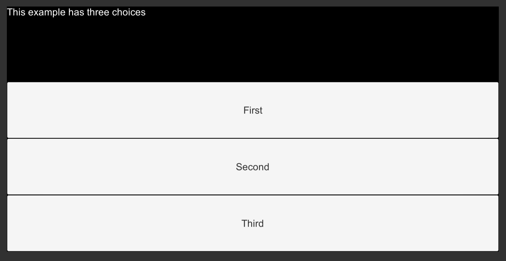

title: "Ink: Selective Output and Story Organization"
order: 13
chapter_number: 13
layout: chapter


## Selective Output

In all previous Ink story examples in this book, choices appeared like the following:

```ink
This example has four choices.

* Choice 1
* Choice 2
* Choice 3
* Choice 4
```

When run, the Scene would show the text "This example has four choices." and then that of the choices. When one of the options was chosen, it would then appear as part of the next chunk of the story.


As running the code in Inky shows, this is the default behavior for choices. Once chosen, its text is carried over into the next story chunk.

In Ink, this behavior can be changed through special syntax called *selective output*. When any part, including the whole text, of a choice is enclosed in opening, `[`, and closing, `]`, brackets, it becomes *selective output*. That is, it is not used as part of the next story chunk.

```ink
This example has four choices.

* [Choice 1]
* [Choice 2]
* [Choice 3]
* [Choice 4]
-
```


Shown when run in Inky, no text of the choices is carried over.



When run in Unity, this shows the same effect. Through using selective output (putting opening and closing square brackets around the text), the text of the choice is not passed to the next story chunk.

## Story Organization

Ink uses the `INCLUDE` keyword to pull the contents of other files into a central one. This helps when organizing projects through dividing up files as parts of area, regions, character, or other logical divisions.

For example, if a project had two areas that were self-contained in files matching their names, it might look like the following:

```ink
INCLUDE Bedroom.ink
INCLUDE LivingRoom.ink

You stand at the doorway and consider the two rooms in front of you.
```

In the above code, the file `Bedroom.ink` would contain Ink code for that area and `LivingRoom.ink` would be the same for its area.

The first two lines pull in the code from those files and make it available in a central file. (Any of their knots or stitches can be accessed because they are part of one large file when compiled together.)

**New Ink.ink:**

```ink
INCLUDE Bedroom.ink
INCLUDE LivingRoom.ink

You stand at the doorway and consider the two rooms in front of you.

-> Rooms

=== Rooms ===
+ [Bedroom]
  -> Bedroom ->
+ [Living Room]
 -> LivingRoom ->
-
-> Rooms
```

Although not covered in-depth in this book, *tunnels*, a concept in Ink where a target is diverted to and then control reverts back to the original location, can often be useful for exploring a location and then returning to a central point.

Through creating tunnels and then returning, the two locations (across two files) can be "explored" as the story branches to the knots and then back again, repeating the search options through sticky choices.

> **Note:** In Ink, a choice can be made "sticky" through using a plus sign, `+`, instead of the normal asterisk, `*`. If the spot in the story where the choice was chosen is returned to, it will remain an option for a player to pick again.

**Bedroom.ink:**

```ink
=== Bedroom ===
You notice a rather messy room with clothes on the floor and even, you notice, on a window.

+ [Go back to doorway?]
->->
```

**LivingRoom.ink:**

```ink
=== LivingRoom ===
There's a TV and some shelves. Looks like the books have been arranged by color rather than by title. It creates a nice rainbow effect across the books.

+ [Go back to doorway?]
->->
```

When the `INCLUDE` keyword is used to pull in the contents of another in an Ink file, its icon changes in the Project window in Unity.


File gain a 'return' symbol marking that its contents are being used in another file. In this case, both `Bedroom.ink` and `LivingRoom.ink` are `INCLUDE`'d in the `New Ink.ink` file.

This is important as, normally, the Ink Unity Integration plugin will automatically detect and re-compile an Ink script file.


For example, adding a new file `New Ink 1.ink` automatically generates the JSON file `New Ink 1.json` in the Project window.

If the file is then `INCLUDE`'d in another file, its JSON file will be removed.

```ink
INCLUDE Bedroom.ink
INCLUDE LivingRoom.ink
INCLUDE New Ink 1.ink

You stand at the doorway and consider the two rooms in front of you.
```

For example, adding the line `INCLUDE New Ink 1.ink` would change both the icon and status of the associated JSON file.


If a file is `INCLUDE`'d in another, the Ink Unity Integration plugin is smart enough to know to remove the previous JSON file, cleaning up the Project window.

However, if multiple JSON files appear matching the name of other Ink files, this is a clear indication that those files are being compiled separately. In which, the existing Ink files should be consulted to find where the missing `INCLUDE` might be needed.
