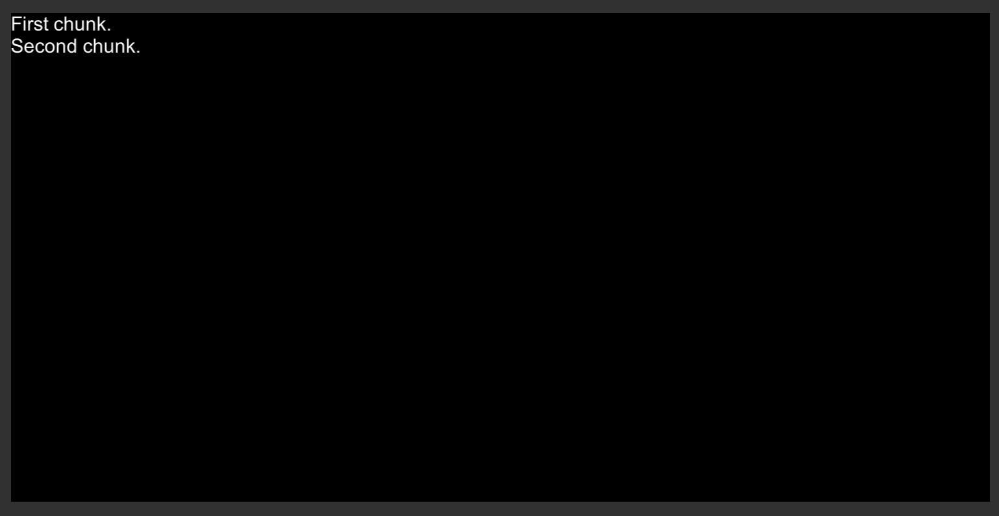
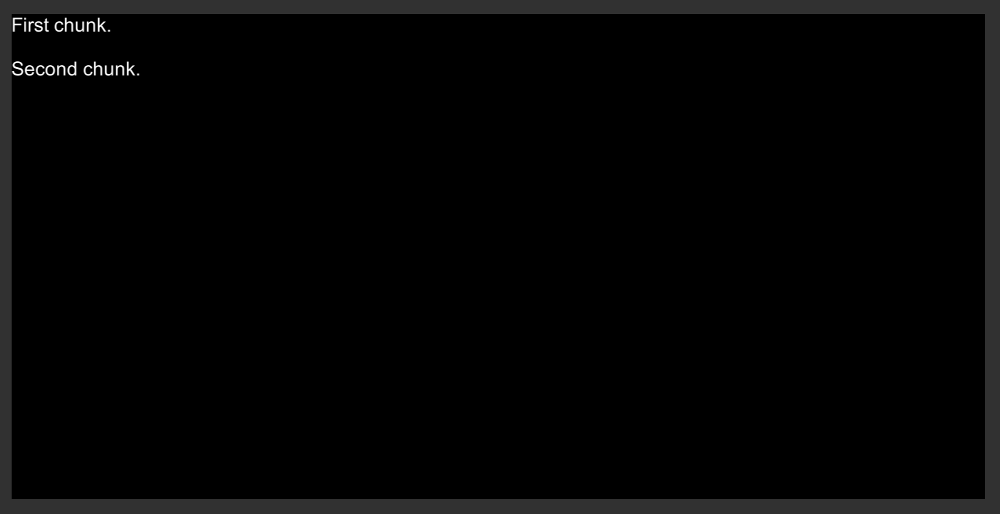
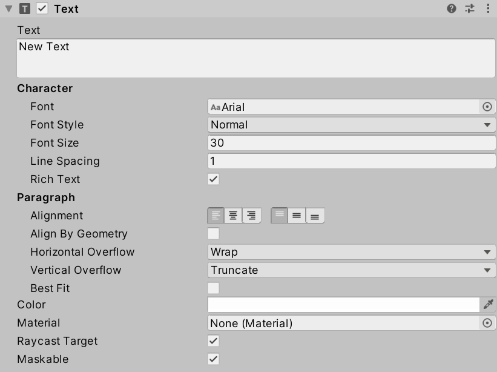
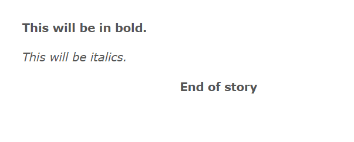
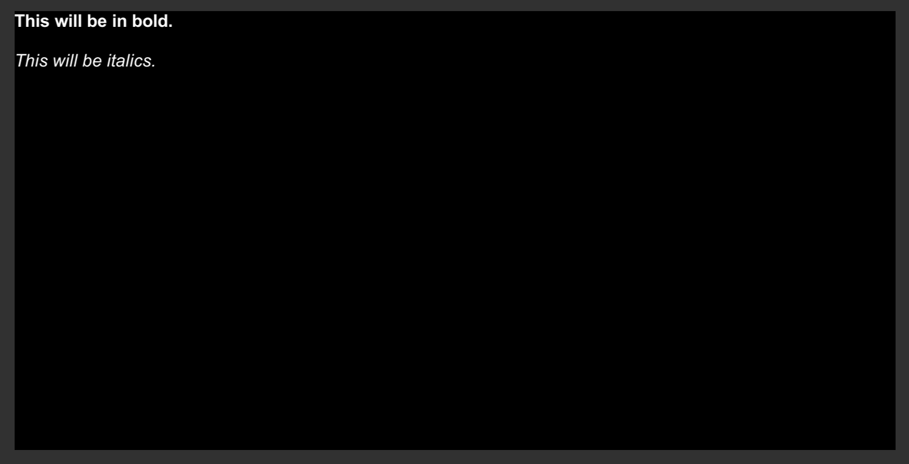
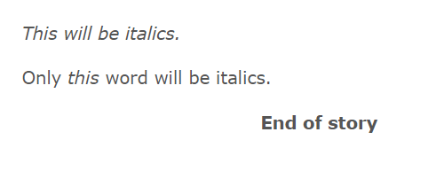
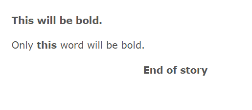

Table of Contents:

- [Integrating Line Breaks](#integrating-line-breaks)
- [Rich Text Support](#rich-text-support)
  - [HTML in Inky](#html-in-inky)
  - [Italics](#italics)
  - [Bold](#bold)

## Integrating Line Breaks

The use of the Ink Story API method **Continue()** loads up to the next newline character in a story chunk. In programming terminology, this is the character `\n`.

In the existing code, each new chunk is concatenated as a new line to an internal **string** value.

```CSharp
// Each loop, check if there is more story to load
while (exampleStory.canContinue)
{
  // Load the next story chunk and return the current text
  string currentTextChunk = exampleStory.Continue();

  // Get any tags loaded in the current story chunk
  List<string> currentTags = exampleStory.currentTags;

  // Create a blank line of dialogue
  string line = "";

  // For each tag in currentTag, set its values to the new variable 'tag'
  foreach (string tag in currentTags)
  {
    // Concatenate the tag and a colon
    line += tag + ": ";
  }

  // Concatenate the current text chunk
  // (This will either have a tag before it or be by itself.)
  line += currentTextChunk;

  // Concatenate the content of 'line' to the existing text
  childText.text += line;

  // ...
}
```

In the above code, this means that any spaces *between* story chunks is erased from the output in Unity.

For example, the following Ink code would produce an erased line between story chunks in Unity.

**New Ink.ink:**

```ink
First chunk.

Second chunk.
```



To fix this issue, an additional concatenation operation can be added to the following line:

```CSharp
// Concatenate the content of 'line' to the existing text
childText.text += line;
```

Adding a newline character to the end of the line would fix this issue.

```CSharp
// Concatenate the content of 'line' to the existing text along with the newline character
childText.text += line + '\n';
```



> **Note:** Adding newlines does not affect the content of choices. Pressing ENTER will break the content of the choice between itself and the next story content inside of the choice.

## Rich Text Support

Clicking on a **Text** GameObject in either the Hierarchy window or as a Prefab will list its components in the Inspector window.



Among the properties is an option for enabling "Rich Text" support. When enabled, this support adds the ability to use [Rich Text](https://docs.unity3d.com/Packages/com.unity.ugui@1.0/manual/StyledText.html) as content in a **Text** GameObject.

In Unity, Rich Text is the ability of **Text** GameObjects to use *markup* to format the output of the text when rendered. In other words, additional opening and closing tags (like HTML) can be added to the text. When it is rendered (drawn on the screen), this markup is interpreted and used to influence the style and presentation of the text.

> **Note:** Tags *must* be closed in Rich Text support.
>
> **2025 Note:** While Unity UI (uGUI) Rich Text remains functional, **TextMeshPro** offers significantly more powerful rich text capabilities including:
> - More markup tags (gradient, sprite, link, etc.)
> - Better text quality and rendering
> - Custom styles and style sheets
> - Advanced text effects
>
> For new projects in 2025, consider using TextMeshPro's rich text system instead. The basic tags shown here (`<b>`, `<i>`, `<color>`, `<size>`) work in both systems.

### HTML in Inky

The editor Inky is built on [Electron](https://www.electronjs.org/) + [Ace](https://ace.c9.io/). It understands the narrative scripting language Ink *and* some HTML as well.

Since Rich Text uses markup that is similar to HTML, this means that it can be used in Inky as if it was HTML and in Unity as the Rich Text tags.

> **Note:** As of 2025, Inky continues to support HTML-like markup in its preview. The tags shown here work identically in both Unity UI and TextMeshPro, making them safe for cross-platform rich text formatting.

```ink
<b>This will be in bold.</b>

<i>This will be italics.</i>
```





### Italics

The tag `<i>` is part of an older version of HTML. However, in Unity, it is supported as part of Rich Text. For both, the effect of using the tag around text content is for it to be *italics*.

```ink
<i>This will be italics.</i>

Only <i>this</i> word will be italics.
```



### Bold

The tag `<b>` is part of an older version of HTML. However, in Unity, it is supported as part of Rich Text. For both, the effect of using the tag around text content is for it to be *bold*.

```ink
<b>This will be bold.</b>

Only <b>this</b> word will be bold.
```


