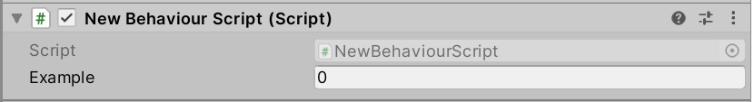
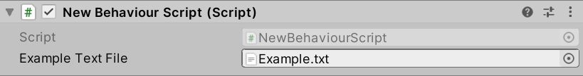
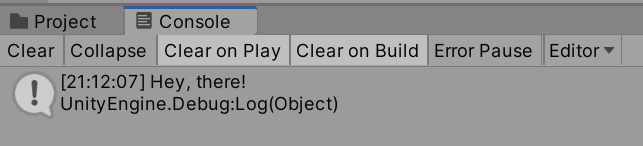

## Objectives

- **Identify** the anatomy of a MonoBehaviour script
- **Explain** the purpose of Unity namespaces and using directives
- **Apply** the Start() and Update() methods in Unity scripts
- **Utilize** SerializeField for exposing private fields in the Inspector
- **Configure** external code editors for Unity development
- **Create** and attach scripting components to GameObjects

## Table of Contents

- [Objectives](#objectives)
- [Table of Contents](#table-of-contents)
- [Anatomy of a MonoBehaviour Script](#anatomy-of-a-monobehaviour-script)
- [**Debug.Log()**](#debuglog)
- [Local **gameObject**](#local-gameobject)
- [Private and Public Properties](#private-and-public-properties)
- [Connecting Assets to Properties](#connecting-assets-to-properties)

---

Because all GameObjects can have scripting components, their behaviors can be changed through writing C\# code. The *scripting component* is additional code that is written that is run as part of the GameObject and can generally be adjusted alongside its other components. However, unlike other components, scripting components (behavior scripts) are edited in an external code editor.

**As of 2025**, Unity supports multiple code editors:

- **Visual Studio** (Windows/Mac): Microsoft's full-featured IDE, still bundled with Unity installations
- **Visual Studio Code**: A lightweight, cross-platform editor that many Unity developers prefer
- **JetBrains Rider**: A powerful C# IDE popular among professional Unity developers for its advanced refactoring and debugging features

> **Note:** While Visual Studio remains a common choice, Visual Studio Code with the Unity extension has become increasingly popular due to its speed and flexibility. Unity will automatically open scripts in your configured editor.

Attempting to open a behavior script in Unity opens the code in your configured external editor.

## Anatomy of a MonoBehaviour Script

```CSharp
using System.Collections;
using System.Collections.Generic;
using UnityEngine;
```

Three namespaces are added by default to all scripts: **System.Collections**, **System.Collections.Generic**, and **UnityEngine**. The first two, **System.Collections** and **System.Collections.Generic**, allow for using the built-in collection data types in C\#. The third, **UnityEngine**, gives access to a large number of built-in data types that come with Unity. These allow for manipulating GameObjects and any values associated with their components.

> **Note:** Modern C# supports implicit `using` directives (C# 10.0+), which means some namespaces may be automatically available without explicit declarations. However, Unity's script templates still include these for clarity.

```CSharp
using System.Collections;
using System.Collections.Generic;
using UnityEngine;

public class NewBehaviourScript : MonoBehaviour
{}
```

The namespace **UnityEngine** also allows access to the class **MonoBehaviour** from which all behavior scripts inherit. This provides a number of methods such as **Start()** and **Update()**.

> **Note:** The spelling "MonoBehaviour" uses the British English spelling. This is maintained for historical reasons and consistency across Unity's API.

As Unity uses the Entity-Component Model as part of its order of execution, these methods will be called as part of the GameObject in the scene.

```CSharp
using System.Collections;
using System.Collections.Generic;
using UnityEngine;

public class NewBehaviourScript : MonoBehaviour
{
    // Start is called before the first frame update
    void Start()
    {
    }

    // Update is called once per frame
    void Update()
    {
    }
}
```

Notably, and as comments remind, **Start()** is called before the first frame of the scene and the method **Update()** is called once per frame. Between these two initial methods, some basic behaviors can be constructed.

As part of the Initialization step of the GameObject, values can also be added to the class. Because all scripts are, in fact, C\# objects, this allows for changing values as part of the Game Logic step in the order of execution. Because this occurs after Input Event and before Rendering steps, any code written within the script can process input and adjust the Transform component values of the GameObject before it is drawn to the screen.

## **Debug.Log()**

Inherited along with many other classes via **UnityEngine** is access to the class **Debug**. As its name implies, this is a class that can be used to *debug*. For example, it has a method, **Log()**, that can be used to display **string** data.

```CSharp
using System.Collections;
using System.Collections.Generic;
using UnityEngine;

public class NewBehaviourScript : MonoBehaviour
{
    // Start is called before the first frame update
    void Start()
    {
      Debug.Log("Hey, there!");
    }

    // Update is called once per frame
    void Update()
    {
    }
}
```

In the above example, the method **Debug.Log()** is used as part of the **Start()** method. When the scene starts and the GameObject is initialized, the code would run and its message `Hey, there!` would be printed to the Console window in Unity.

> **Note:** If not already open, the Console window can be opened in Unity through going to Window -> General -> Console to open it.

While developing C\# code in Visual Studio and testing in the Unity Editor, the method **Debug.Log()** is a very useful tool. Because it can be used as part of any method within the behavior script, it has the ability to show information while code is running in the Unity Editor.

## Local **gameObject**

In order to access the GameObject the scripting component is attached to, all scripts have access to a local **gameObject** object that is inherited from the **MonoBehaviour**. This means that the script has access to the object, its properties, and any other components attached to it through existing methods inherited from the parent **MonoBehaviour**.

For example, when using the **Debug.Log()** method, the name of the GameObject the current scripting component is currently attached to can be shown in the Console window in the Unity Editor.

```CSharp
using System.Collections;
using System.Collections.Generic;
using UnityEngine;

public class NewBehaviourScript : MonoBehaviour
{
    // Start is called before the first frame update
    void Start()
    {
      Debug.Log(gameObject.name);
    }

    // Update is called once per frame
    void Update()
    {
    }
}
```

## Private and Public Properties

As with any other class in C\#, any private field in an object cannot be accessed outside of that object. However, while setting a field as `public` may seem to allow access outside of the object, it has an additional aspect when used in a scripting component in Unity. All public properties in a scripting component can *also* be accessed in the Unity Editor itself.

> **Modern Best Practice (2025):** While public fields still work, Unity now recommends using `[SerializeField]` with private fields for better encapsulation:

```CSharp
[SerializeField] private int example;  // Visible in Inspector, but encapsulated
public int Example { get; private set; } // Property pattern
```

While not obvious, exposing values in the Inspector through public fields or `[SerializeField]` and then adjusting their values from inside the Unity Editor is a standard and encouraged practice when using scripting components and the Unity Editor. In fact, many tutorials, guides, and other resources demonstrate this practice frequently.

**Note:** The reasoning behind this practice is because Unity uses the Entity-Component Model. Scripting components are just that, *components*. Any scripting added to a GameObject is not the object itself, but *additional* components added to that entity. The code is **not** the GameObject. It is scripting *added* to the GameObject to adjust its default behaviors.

**Example Public Property:**

```CSharp
using System.Collections;
using System.Collections.Generic;
using UnityEngine;

public class NewBehaviourScript : MonoBehaviour
{
    public int Example;
    // Start is called before the first frame update
    void Start()
    {
    }

    // Update is called once per frame
    void Update()
    {
    }
}

```



As the above example demonstrates, when a public property is added within the code representing the scripting component matching its name, it is added in the Unity Editor as part of that component.

**Reminder:** It is general style convention in C\# to name properties and methods using PascalCase where the first letter of each word is capitalized. The Unity Editor also supports this and will capitalize the first letter of any public property if it is not already capitalized as it should be.

This allows it to be changed without updating the code. Changing the value in the Unity Editor will update the value during the Initialization step of the order of execution. This means that the code will have the value *before* its **Start()** method is called.

## Connecting Assets to Properties

Because scripting components are *components* and any public properties within the code can be accessed within the Unity Editor, this creates the ability to connect different values. This is also a common and efficient way to create explicit connections between Assets and scripting code through creating a public property representing that data and then dragging-and-dropping an Asset onto that value in the Unity Editor. For scripts that need to parse or otherwise have access to certain data sources, this creates an easy way to connect an Asset to the scripting component.

Any public properties available in the Unity Editor will has its values updated during the Initialization step of the GameObject, thus giving it a value *before* its **Start()** method is called.

Consider the following example:

**NewBehaviourScript.cs:**

```CSharp
using System.Collections;
using System.Collections.Generic;
using UnityEngine;

public class NewBehaviourScript : MonoBehaviour
{
    public TextAsset ExampleTextFile;

    // Start is called before the first frame update
    void Start()
    {
        Debug.Log(ExampleTextFile.text);
    }

    // Update is called once per frame
    void Update()
    {
    }
}
```

**Example.txt:**

```txt
Hey, there!
```



Through creating a file `Example.txt` within the project and then dragging-and-dropping the asset on the public property "Example Text File", Unity connects the Asset with the public property **ExampleTextFile** of the type **TextAsset**.

> **Note:** The datatype **TextAsset** is one of many built-in objects in Unity to help with certain common types of assets. In this case, **[TextAsset](https://docs.unity3d.com/ScriptReference/TextAsset.html)** is used when working with textual data.

Now, when the scene is run, Unity will associate with the Asset `Example.txt` with the file property **ExampleTextFile** during the Initialization step of the order of execution. Before the **Start()** method is called in the **NewBehaviourScript** object, it will have the loaded asset.



Using the property *[text](https://docs.unity3d.com/ScriptReference/TextAsset-text.html)* of the **ExampleTextFile** object, the **Debug.Log()** method can display the content of the file in the Console window in Unity.
