- [Windows](#windows)
  - [Hierarchy](#hierarchy)
    - [Visibility and Picking](#visibility-and-picking)
    - [Searching](#searching)
  - [Inspector](#inspector)
    - [Transform Component](#transform-component)
    - [Adding Components](#adding-components)
      - [Adding Scripting Components](#adding-scripting-components)
    - [Inspecting Assets](#inspecting-assets)
  - [Project](#project)
- [Views](#views)
  - [Scene](#scene)
    - [Draw Mode](#draw-mode)
    - [2D / 3D](#2d--3d)
    - [Scene Lighting](#scene-lighting)
    - [Scene Audio](#scene-audio)
    - [Effects](#effects)
    - [Hidden Objects](#hidden-objects)
    - [Grid Visibility](#grid-visibility)
  - [Game](#game)
    - [Displays](#displays)
    - [Resolution Aspect](#resolution-aspect)
    - [Scale](#scale)
    - [Maximize on Play](#maximize-on-play)
    - [Mute Audio](#mute-audio)
    - [Stats](#stats)
    - [Gizmo Options](#gizmo-options)
- [Tools](#tools)
  - [Transform](#transform)
  - [Gizmo Settings](#gizmo-settings)
    - [Position](#position)
    - [Rotation](#rotation)
  - [Play, Pause, and Step](#play-pause-and-step)
    - [Runtime Editing](#runtime-editing)
  - [Collaborate](#collaborate)
  - [Cloud](#cloud)
  - [Account](#account)
  - [Layers](#layers)
  - [Layout](#layout)

---

The user interface of the Unity Editor is divided up into three central metaphors: windows, views, and tools.

## Windows

### Hierarchy

The Hierarchy window lists every GameObject in the Scene.

The name "hierarchy" also comes from the representation of relationships between GameObjects in the Scene. If one GameObject is the parent or container of one or more GameObjects, their names will be under their parent's name in the listing.

Through dragging-and-dropping one or more GameObjects, they can be placed under a parent or removed from that parent through moving them out from "under" their name.

#### Visibility and Picking

As the number of GameObjects can potentially be quite large, the Hierarchy window also includes visibility settings for every GameObject. Through clicking on the eye icon to the left of one or more GameObjects, it will be hidden in the Scene view.

Next to the Scene Visibility icon is also the Picking icon. Through clicking on a GameObject's picking icon, it becomes selected in the Scene View. This allows for quickly selecting certain GameObjects without also potentially excluding others.

#### Searching

To help with finding a GameObject by its name, the Hierarchy window includes a search bar. As the name of a GameObject is typed, the results are shown under the name of the current Scene.

### Inspector

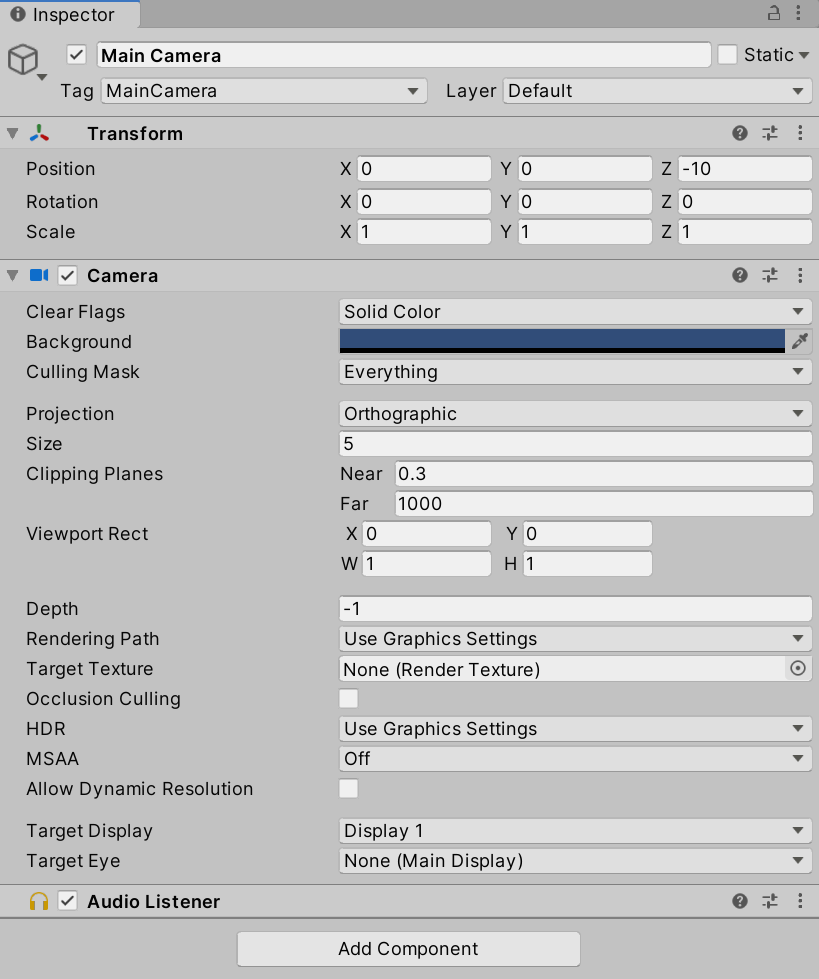

When a GameObject or Asset is selected in the Hierarchy window, its components will appear in the Inspector window.

Depending on the type of object, it may have multiple built-in components whose values can be adjusted directly.

#### Transform Component

All GameObjects have a Transform Component for adjusting their Position, Rotation, and Scale.

#### Adding Components

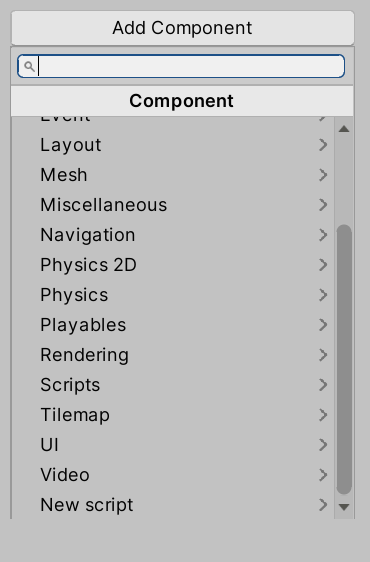

Clicking on the "Add Component" button open a menu for selecting new components to add.

##### Adding Scripting Components

Selecting "New script" from the "Add Component" menu prompts for the new of a new behavior script.

Clicking "Create and Add" (assuming a script does not already exist with the same name) will create the script in the Project window and attach it as a scripting component to the current GameObject.

Double-clicking the file will open it in Visual Studio.

#### Inspecting Assets

If an Asset is selected from the Project window, its properties and contents will be shown in the Inspector window. Depending on the type, different settings, properties, and options will be available.

### Project

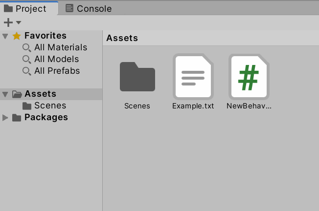

The Project window shows all assets that are part of the current project. This also includes any imported assets or files added to the asset folder outside of using the Unity Editor to create them.

The contents of the Project Window can be sorted through creating new folders using either the "+" menu under its title or using the right-click context menu. By default, the Project window includes a folder "Scenes" containing the current scene. (This is "SampleScene" by default).

> **Note:** As of 2025, Unity's Project window supports two view modes: one-column and two-column layouts. You can switch between these using the icon in the lower-right corner of the Project window. The two-column layout provides a folder tree on the left and contents on the right, which many developers find more efficient for navigation.

It is recommended to create folders for all types of Assets used in the Project sorted by either scene or by type of data. In a project with multiple scenes, for example, sorting assets by scene can help in organizing them. For smaller projects, or those with only one scene, sorting by type is a good approach. Creating a folder called "Scripts" for all files related to scripting components and another for "Sprites" or "Prefabs", for example.

## Views

In the default layout, there are two views in the center of the Unity Editor window: Scene and Game.

### Scene

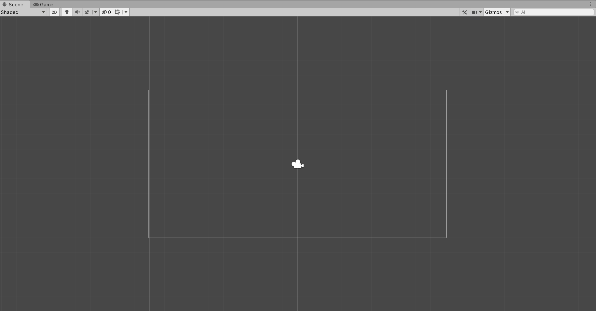

As GameObjects are added to the scene, they appear in both the Hierarchy window and Scene view. Through selecting GameObjects in the Scene view, they can be manipulated through their gizmos or using the toolbar.

#### Draw Mode

Under the Scene title is the Draw Mode. By default "Shaded" is selected. However, other shading and baked lighting options can be chosen if the GameObjects in the scene support them.

#### 2D / 3D

If a project is created in 2D, the 2D option and button will be selected.

If the project is using 3D, the 2D option will be disabled and an additional 3D gizmo is added to the scene for changing the viewing orientation and perspective.

#### Scene Lighting

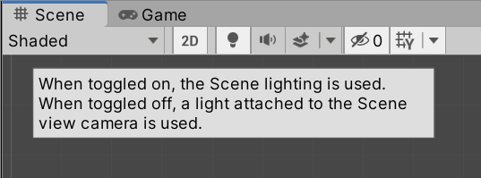

Depending on toggle, the scene will use the scene lighting or a light attached to the Scene camera view.

#### Scene Audio

Depending on the toggle, audio will play in the scene or not.

#### Effects

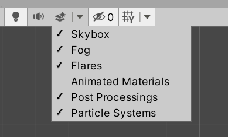

Different scene effects such as the Skybox, Fog, and Particle Systems can be toggled on and off.

#### Hidden Objects

If any GameObjects have been hidden in the Hierarchy window, the current count is shown. The entire scene can also be hidden.

#### Grid Visibility

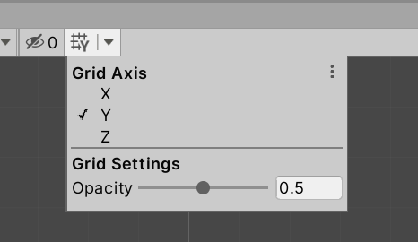

Depending on the orientation, the visibility of the axis (X, Y, or Z) can be adjusted along with its opacity.

### Game

When a Scene is running, the Game View shows a simulation of what the rendered game would look like using the Scene camera.

If the Play button is clicked, the Unity Editor will automatically shift from the Scene View to the Game View.

#### Displays

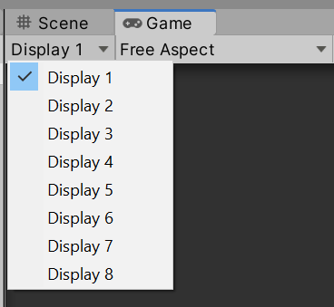

Depending on the cameras and their settings used in the scene, Unity supports up to eight different displays.

#### Resolution Aspect

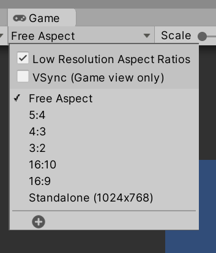

The current resolution and aspect ration can be adjusted when simulating the rendering of the scene.

#### Scale

The current scaling of the game View can be adjusted.

#### Maximize on Play

If Maximize on Play is selected, the Game View will fill all available horizontal and vertical space in the Unity Editor while the scene is running.

#### Mute Audio

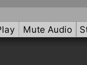

Scene audio can be muted.

#### Stats

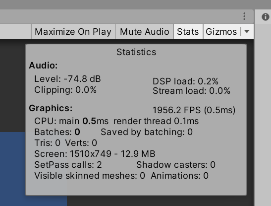

Clicking on the "Stats" button shows the current graphical and computational statistics of the scene.

#### Gizmo Options

The Gizmos menu allows for enabling or disabling the gizmos for types of GameObjects.

## Tools

### Transform

When a GameObject is selected, it can be manipulated through the Transform tools. This allows for moving, positioning, rotating, selecting multiple GameObjects (Rect Tool), and then adjusting those GameObjects.

If any custom tools have been added, they can also be accessed through the Custom Tool menu button.

### Gizmo Settings

> **Note:** In Unity terminology, a *gizmo* is a graphical overlay associated with a GameObject when selected in the Scene view.

#### Position

The Pivot/Center button adjusts the position of the Gizmo.

When Pivot is selected, the Gizmo is positioned at the pivot point of the GameObject as defined by the Transform component.

If Center is selected, the Gizmo position is set to the center position of the GameObject.

#### Rotation

The Local/Global button adjusts rotation of the Gizmo in relation to the GameObject.

- When Local is selected, the Gizmo's rotation is relative to the GameObject.

- When Global is selected, the Gizmo is oriented to the world space.

### Play, Pause, and Step

The Play, Pause, and Step buttons control if the scene is running and its current status.

- Clicking on the Play button will start to play the scene and will continue until clicked again or an error occurs that prevents the scene from continuing.

- The Pause button stops the scene from playing. It can be resumed through clicking on the Pause button a second time or clicking on the Play button.

- If debugging is being used, the Step button will move to the next debugging point, if available. If there are no debugging points in the current scene, the Step button will not be available.

#### Runtime Editing

When a scene is running, GameObjects can be manipulated and the values of its properties and components changed. However, **these changes are not saved.** Any changes made while a scene is running only affect that scene. They are not saved.

### Collaborate

> **Note:** Unity Collaborate was deprecated in 2021 and replaced by Unity Version Control (formerly Plastic SCM). As of 2025, most Unity developers use either:
>
> - **Unity Version Control** (built into Unity Hub for cloud-based version control)
> - **Git** with services like GitHub, GitLab, or Bitbucket
> - **Perforce** for larger team projects
>
> For new projects, it's recommended to use Git with a `.gitignore` file configured for Unity, or Unity Version Control for integrated cloud collaboration.

### Cloud

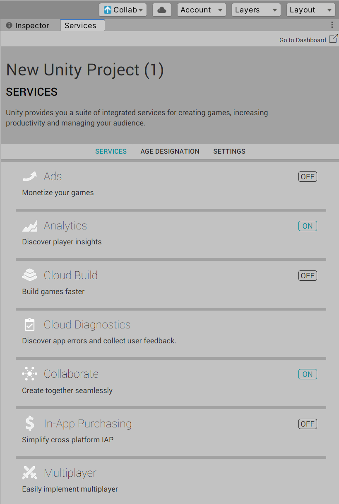

Unity Cloud services have evolved significantly. As of 2025, Unity provides various cloud services including Unity Gaming Services (UGS) which includes:

- **Unity Authentication**: Player identity management
- **Cloud Save**: Save game data in the cloud
- **Matchmaker**: Multiplayer matchmaking
- **Lobby**: Multiplayer lobby management

These services can be accessed through the Services window in Unity or the Unity Dashboard.

### Account

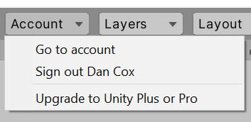

Clicking on the Account button shows the current signed-in Unity ID user and account information. As of 2025, Unity uses:

- **Unity ID**: Single sign-on for all Unity services
- **Unity Cloud**: Access to cloud-based features and services
- **License Management**: View and manage your Unity subscription (Personal, Plus, Pro, Enterprise, Student)

You can manage your account, access Unity Cloud Dashboard, and configure license settings from this menu.

### Layers

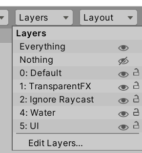

The "Layers" menu allows access to which objects appear in the Scene view. If a GameObject is associated with the layer and that layer is hidden, those GameObjects will not be shown.

### Layout

Clicking on the "Layout" button allows for quickly changing the layout of the windows and views within the Unity Editor.

Unity includes several built-in layout presets:

- **Default**: Standard 2-column layout
- **Tall**: Optimized for vertical monitors
- **Wide**: Optimized for ultrawide displays
- **2 by 3**: Game view focused layout

Once windows and views are arranged, custom layouts can be saved and recalled. This is particularly useful when switching between different workflows (coding, level design, animation, etc.).
