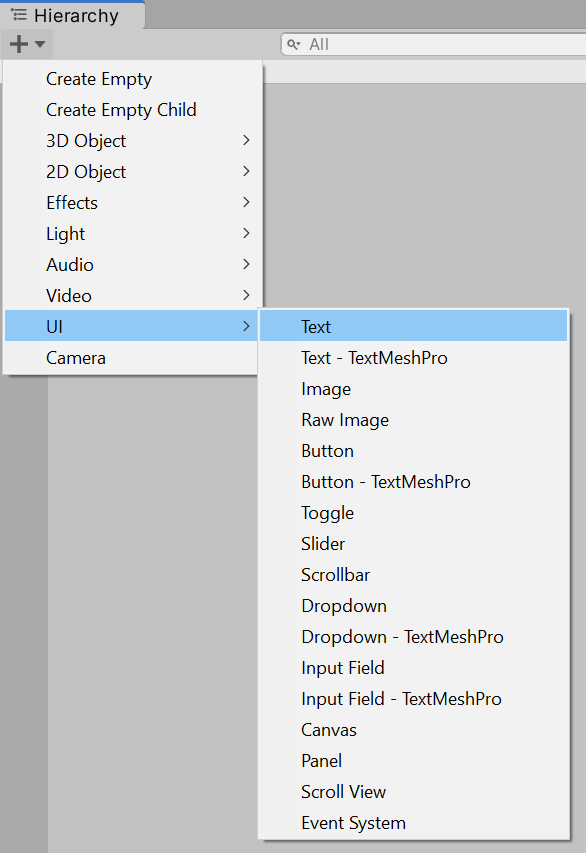
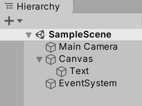
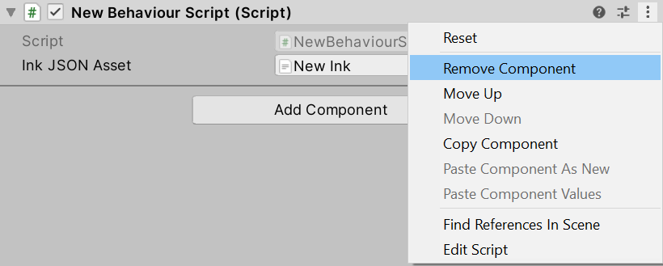
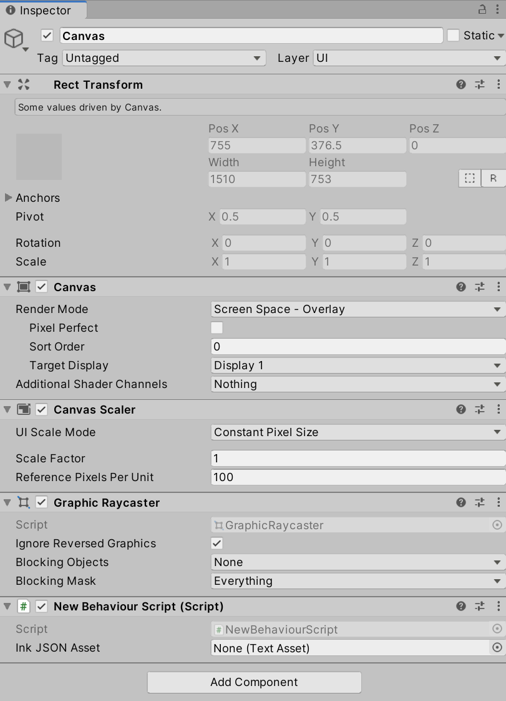
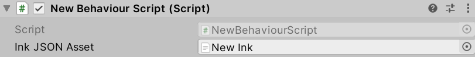

# Chapter 10: Unity UI: Introducing Canvas and Text

- [Chapter 10: Unity UI: Introducing Canvas and Text](#chapter-10-unity-ui-introducing-canvas-and-text)
  - [Adding GameObjects](#adding-gameobjects)
    - [Adding **Text**](#adding-text)
    - [Removing Scripting Components](#removing-scripting-components)
    - [Attaching Existing Scripting Components](#attaching-existing-scripting-components)
  - [Working With **Canvas**](#working-with-canvas)
  - [Adjusting **Text** Properties](#adjusting-text-properties)
  - [Accessing **Text** Components During Runtime](#accessing-text-components-during-runtime)
  - [Working With Rich Text Content](#working-with-rich-text-content)

---

## Adding GameObjects

Previously in this book, the method **Debug.Log()** has been used to show text content in the Console window. While useful for debugging and testing, the method does not show text within the Scene or Game Views. For that, new GameObjects are needed.

### Adding **Text**



Using either the Add menu or right-clicking, go to UI -> Text. This will add a new **Text** GameObject to the Scene.



The **Text** GameObject cannot be shown by itself, so Unity also adds a **Canvas** GameObject and a GameObject called **EventSystem**. A **Canvas** GameObject represents the abstract space of user interface GameObjects. It serves as both collection and to define of the bounds of the screen. GameObjects within the category of User Interface (UI) also expect some form of user interaction, so the **EventSystem** is added to help with those events.

### Removing Scripting Components

In previous examples in this book, a Scripting Component was added to the **Main Camera** GameObject to demonstrate various functionality and how to use the Story API. That is no longer needed, so that component can be removed from the **Main Camera**.



Through clicking on the **Main Camera**, it components will be listed in the Inspector Window. Clicking on the extended settings (three dots) of the component and then clicking "Remove Component" will remove the component from the **Main Camera**.

> **Reminder:** Removing a component from a GameObject does not delete any assets associated with that component. They remain part of the Project and can be used with other components.

### Attaching Existing Scripting Components

With the Scripting Component now removed from the **Main Camera**, the existing `NewBehaviourScript.cs` file will no longer be active and run in the Scene.

Previously, it made sense to use the **Main Camera**, as it was the only component in the Scene. However, with **Canvas** and **Text** objects, a new component can be added. Considering that the **Text** GameObject is a child of the parent **Canvas** GameObject, it now makes sense to create a Scripting Component on this GameObject.

However, instead of creating a new Scripting Component, the existing C\# file can be dragged and dropped from the Project window into the existing components of the **Canvas** GameObject in its Inspector Window. While the **Canvas** GameObject is selected, dropping the `NewBehaviourScript.cs` file will create a new Scripting Component and associated the file with the component.



As was done in previous chapters, the compiled Ink (JSON) file now needs to be re-associated with the Scripting Component. Like was done previously, dragging and dropping the file will associate it with the "Ink JSON Asset" property.



While included in previous chapters, the contents of the `NewBehaviourScript.cs` file is included below:

**NewBehaviourScript.cs:**

```CSharp
using System.Collections;
using System.Collections.Generic;
using UnityEngine;
// Add the Ink Runtime
using Ink.Runtime;

public class NewBehaviourScript : MonoBehaviour
{
    // Add a TextAsset representing the compiled Ink Asset
    public TextAsset InkJSONAsset;

    // Start is called before the first frame update
    void Start()
    {
        // Create a new Story object using the compiled (JSON) Ink story text
        Story exampleStory = new Story(InkJSONAsset.text);

        // Each loop, check if there is more story to load
        while (exampleStory.canContinue)
        {
            // Load the next story chunk and return the current text
            string currentTextChunk = exampleStory.Continue();

            // Get any tags loaded in the current story chunk
            List<string> currentTags = exampleStory.currentTags;

            // Create a blank line of dialogue
            string line = "";

            // For each tag in currentTag, set its values to the new variable 'tag'
            foreach (string tag in currentTags)
            {
                // Concatenate the tag and a colon
                line += tag + ": ";
            }

            // Concatenate the current text chunk
            // (This will either have a tag before it or be by itself.)
            line += currentTextChunk;

            // Print the current line using the combined string 
            //  created from the current tag and story chunk.
            Debug.Log(line);
        }
    }
}
```

## Working With **Canvas**

TODO

## Adjusting **Text** Properties

## Accessing **Text** Components During Runtime

## Working With Rich Text Content
