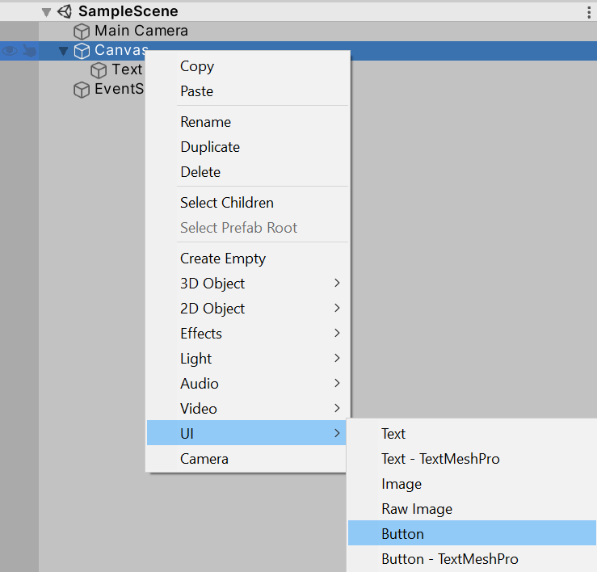
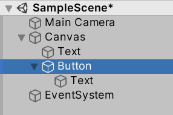
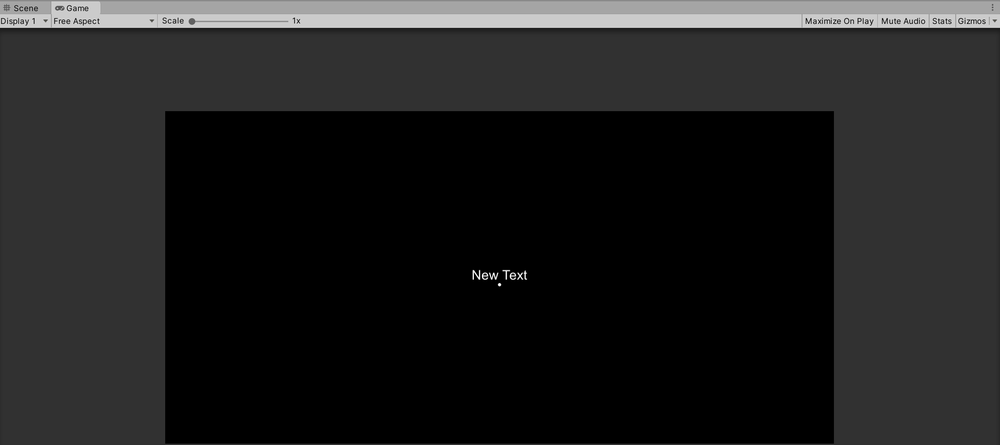
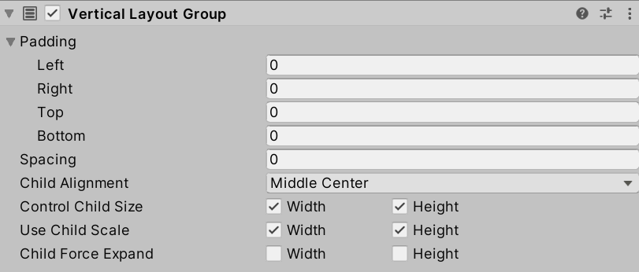
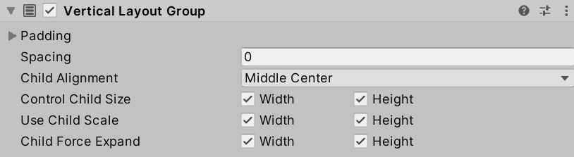
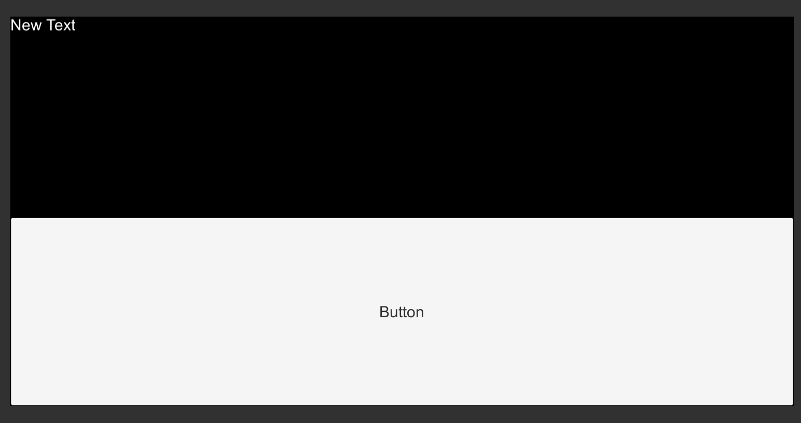
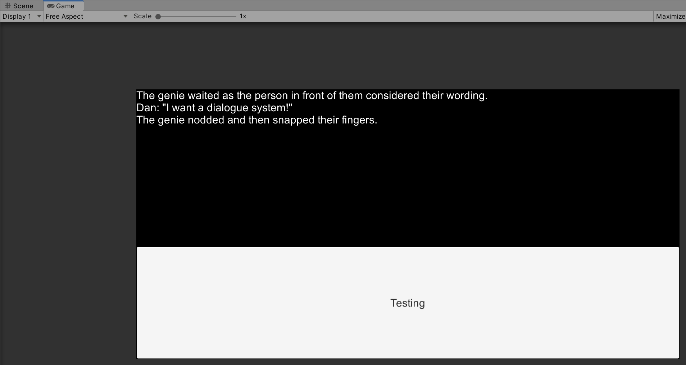
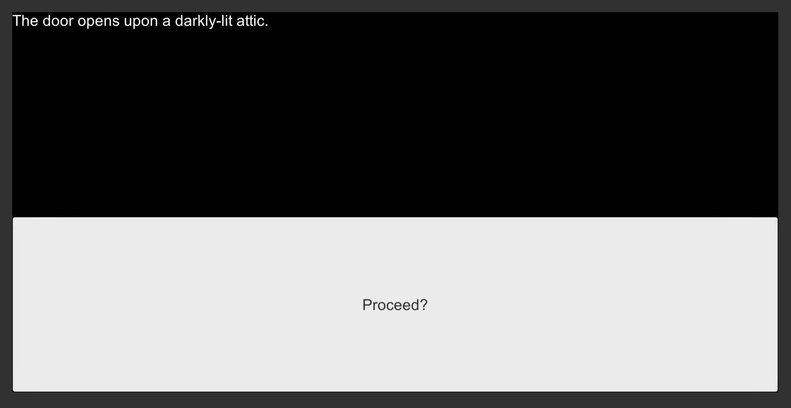

# Chapter 11: Unity UI: Buttons and User Input

- [Chapter 11: Unity UI: Buttons and User Input](#chapter-11-unity-ui-buttons-and-user-input)
  - [Working with Buttons](#working-with-buttons)
    - [Forcing Child Expansion](#forcing-child-expansion)
    - [Parsing Choices into Buttons](#parsing-choices-into-buttons)
  - [Creating Prefabs](#creating-prefabs)
  - [Dynamically Creating Buttons](#dynamically-creating-buttons)
  - [User Interface Events](#user-interface-events)
  - [Dynamically Loading Story](#dynamically-loading-story)

---

## Working with Buttons

The **Button** is a fundamental user interface element. It is a something a user can click on that should produce some effect.



Based on the GameObject created previously in this book, adding a new **Button** GameObject to the existing **Canvas** is possible through right-clicking on it, going to UI, and then clicking on Button. This will add a **Button** as a child of **Canvas**.



Once added, the new **Button** will be child of the **Canvas** and also have its own child: another **Text**. This is because the **Button** is only that, a button. The text component of the **Button** is actually another **Text**.



When viewed on the Game View, the existing **Text** (with its *text* of "New Text") and the button will be arranged vertically (due to the use of the Vertical Layout Group added in the previous chapter). However, when viewed, the **Button** is small compared to the existing content of the **Canvas**.

### Forcing Child Expansion



In the previous chapter, the option Child Force Expand was left unchecked in the Vertical Layout Group Properties. While this worked with the sole child of **Text**, with the additional child GameObject of **Button**, it now needs to be used to force all children to expand within the **Canvas**.

> **Reminder:** Clicking on a component in the Hierarchy Window lists its components in the Inspector Window. Clicking on **Canvas** allows for accessing its components and the properties of the Vertical Layout Group.



The result of forcing the child GameObjects to expand can be seen in the Game View.



With the new option checked, all of the child GameObjects are forced to expand to fill the available space of the **Canvas**.

While not ideal, the new arrangement of GameObjects is a good place to stop and return to C\# code in order to start processing **Choice** objects and using their *text* properties to change the *text* of the **Text** child of the **Button**.

### Parsing Choices into Buttons

Based on what was introduced in a previous chapter, the [method **GetComponentInChildren\<GameObject\>()**](https://docs.unity3d.com/ScriptReference/Component.GetComponentInChildren.html) can be used to search for a child component starting from a parent GameObject. In the case of **Canvas**, because the added **Button** is now a child of it, the method can be used again. This time, instead of searching for **Text**, it can be used to find the added **Button**.

```CSharp
// From this GameObject, look in its children for a component of the type "Button".
// Return a reference to this component and save it locally.
Button childButton = GetComponentInChildren<Button>();
```

This time, unlike in the previous chapter with using the now saved component, an additional search is needed to find the **Text** child of the found **Button**.

```CSharp
// From this GameObject, look in its children for a component of the type "Button".
// Return a reference to this component and save it locally.
Button childButton = GetComponentInChildren<Button>();

// From this GameObject, look in its children for a component of the type "Text".
// Return a reference to this component and save it locally.
Text buttonText = childButton.GetComponentInChildren<Text>();
```

> **Note:** It would seem to make sense that **GetComponentInChildren\<GameObject\>()** could be used to get the second **Text** through using it a second time, but is not the case. The method **GetComponentInChildren\<GameObject\>()** returns the *first* component it finds. When searching from **Canvas**, this finds its child **Text** first. When searching from **Button**, this finds *its* **Text** component first.

Finally, to demonstrate the editing of its *text* property, the following line is added:

```CSharp
// Change the text
buttonText.text = "Testing";
```

Put all together with the existing code developed in the previous chapter, it would be the following:

**NewBehaviourScript.cs:**

```CSharp
using System.Collections;
using System.Collections.Generic;
using UnityEngine;
// Add the Ink Runtime
using Ink.Runtime;
// Add Unity UI
using UnityEngine.UI;

public class NewBehaviourScript : MonoBehaviour
{
    // Add a TextAsset representing the compiled Ink Asset
    public TextAsset InkJSONAsset;

    // Start is called before the first frame update
    void Start()
    {
        // Create a new Story object using the compiled (JSON) Ink story text
        Story exampleStory = new Story(InkJSONAsset.text);

        // From this GameObject, look in its children for a component of the type "Text".
        // Return a reference to this component and save it locally.
        Text childText = GetComponentInChildren<Text>();

        // Reset the existing text of "New Text" to an empty string
        childText.text = "";

        // From this GameObject, look in its children for a component of the type "Button".
        // Return a reference to this component and save it locally.
        Button childButton = GetComponentInChildren<Button>();

        // From this GameObject, look in its children for a component of the type "Text".
        // Return a reference to this component and save it locally.
        Text buttonText = childButton.GetComponentInChildren<Text>();

        // Change the text
        buttonText.text = "Testing";

        // Each loop, check if there is more story to load
        while (exampleStory.canContinue)
        {
            // Load the next story chunk and return the current text
            string currentTextChunk = exampleStory.Continue();

            // Get any tags loaded in the current story chunk
            List<string> currentTags = exampleStory.currentTags;

            // Create a blank line of dialogue
            string line = "";

            // For each tag in currentTag, set its values to the new variable 'tag'
            foreach (string tag in currentTags)
            {
                // Concatenate the tag and a colon
                line += tag + ": ";
            }

            // Concatenate the current text chunk
            // (This will either have a tag before it or be by itself.)
            line += currentTextChunk;

            // Concatenate the content of 'line' to the existing text
            childText.text += line;
        }
    }
}
```

When run, the *text* of the child GameObject of **Button** will be overwritten.



With this in place, it is time to change the existing Ink story from the previous chapters and re-introduce the code to parse **Choice** objects.

**New Ink.ink:**

```ink
The door opens upon a darkly-lit attic.

* [Proceed?]
-

You cautiously walk forward, noting the dust coating everything around you. Looking down, you even seen your own footprints in the dust from the door.
```

In the new Ink code, there is a choice with selected output. (This means the words in the choice will not appear in the output.) It is also using a gathering point, `-`, that will gather the story back into the point after the set of choices instead of branching it.

To parse the new choice in the Ink story, the inner loop code developed in previous chapters can be used again.

```CSharp
// For each choice in currentChoices, set its values to the new variable 'choice'
foreach (Choice choice in exampleStory.currentChoices)
{
}
```

This time, instead of using **Debug.Log()**, the *text* of the **choice** will be used to overwrite the *text* of the **Button**'s **Text**.

```CSharp
// For each choice in currentChoices, set its values to the new variable 'choice'
foreach (Choice choice in exampleStory.currentChoices)
{
    // Set the button's text to the choice's text
    buttonText.text = choice.text;
}
```

Put at the end of the previous code inside of the `while()` loop, it would look like the following:

**NewBehaviourScript.cs:**

```CSharp
using System.Collections;
using System.Collections.Generic;
using UnityEngine;
// Add the Ink Runtime
using Ink.Runtime;
// Add Unity UI
using UnityEngine.UI;

public class NewBehaviourScript : MonoBehaviour
{
    // Add a TextAsset representing the compiled Ink Asset
    public TextAsset InkJSONAsset;

    // Start is called before the first frame update
    void Start()
    {
        // Create a new Story object using the compiled (JSON) Ink story text
        Story exampleStory = new Story(InkJSONAsset.text);

        // From this GameObject, look in its children for a component of the type "Text".
        // Return a reference to this component and save it locally.
        Text childText = GetComponentInChildren<Text>();

        // Reset the existing text of "New Text" to an empty string
        childText.text = "";

        // From this GameObject, look in its children for a component of the type "Button".
        // Return a reference to this component and save it locally.
        Button childButton = GetComponentInChildren<Button>();

        // From this GameObject, look in its children for a component of the type "Text".
        // Return a reference to this component and save it locally.
        Text buttonText = childButton.GetComponentInChildren<Text>();

        // Each loop, check if there is more story to load
        while (exampleStory.canContinue)
        {
            // Load the next story chunk and return the current text
            string currentTextChunk = exampleStory.Continue();

            // Get any tags loaded in the current story chunk
            List<string> currentTags = exampleStory.currentTags;

            // Create a blank line of dialogue
            string line = "";

            // For each tag in currentTag, set its values to the new variable 'tag'
            foreach (string tag in currentTags)
            {
                // Concatenate the tag and a colon
                line += tag + ": ";
            }

            // Concatenate the current text chunk
            // (This will either have a tag before it or be by itself.)
            line += currentTextChunk;

            // Concatenate the content of 'line' to the existing text
            childText.text += line;

            // For each choice in currentChoices, set its values to the new variable 'choice'
            foreach (Choice choice in exampleStory.currentChoices)
            {
                // Set the button's text to the choice's text
                buttonText.text = choice.text;
            }

        }
    }
}
```



When run, the choices within the Ink Story API property *currentChoices* will be parsed and their *text* used to overwrite the *text* of the **Button**'s **Text**. This would place the text inside the of the **Button** and present the user with an option.

The current solution, while great for only one option per choice set in an Ink story, only has one **Button**. If the story presented multiple options for the player, this would not work well. There needs to be a way to create one or more **Buttons** dynamically as needed. Instead of overwriting a single button each time, they could be created and destroyed as needed.

## Creating Prefabs

## Dynamically Creating Buttons

## User Interface Events

## Dynamically Loading Story
