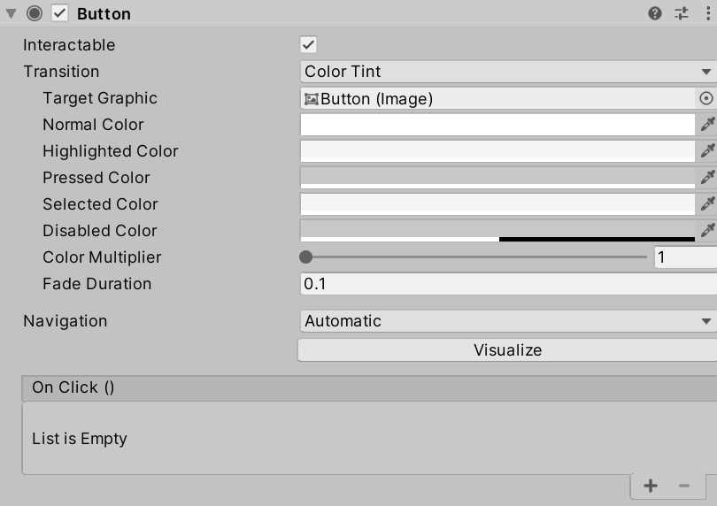
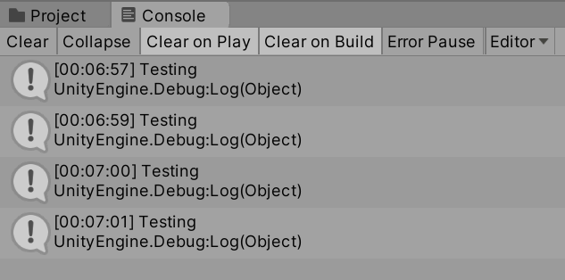

# Chapter 12: Unity UI: User Events and Dynamic Story Loading

- [Chapter 12: Unity UI: User Events and Dynamic Story Loading](#chapter-12-unity-ui-user-events-and-dynamic-story-loading)
  - [User Events](#user-events)
    - [Adding Event Listeners](#adding-event-listeners)
    - [Choosing Choices](#choosing-choices)
  - [Refreshing User Interfaces](#refreshing-user-interfaces)
    - [Destroying Buttons](#destroying-buttons)
    - [Creating Text and Buttons](#creating-text-and-buttons)

---

## User Events

All user interface GameObjects have access to user events. In fact, in a previous chapter when a **Canvas** GameObject was added to the Scene, an additional GameObject, **Event System**, was added to the Scene. This provides access to user events and helps in responding to them internally.

Like GameObjects have access to the methods **Start()** and **Update()**, user interface GameObjects have access to different user event properties. For a [Button](https://docs.unity3d.com/Packages/com.unity.ugui@1.0/manual/script-Button.html), the event is *OnClick*. If a method is used with this property, it will be called when the user clicks the button.



In the Inspector window of a **Button** is an area named "On Click ()" and lists all methods that are called when the user event happens to the **Button**.

However, as was changed in the last chapter, the **Button** is a Prefab and is created dynamically as part of the code that was added at the end of the last chapter.

```CSharp
// For each choice in currentChoices, set its values to the new variable 'choice'
foreach (Choice choice in exampleStory.currentChoices)
{
    // Create a new GameObject based on a Prefab and set its parent to this.transform
    Button choiceButton = Instantiate(ButtonPrefab, this.transform);

    // From choiceButton, look in its children for a component of the type "Text".
    // Return a reference to this component and save it locally.
    Text choiceText = choiceButton.GetComponentInChildren<Text>();

    // Set the button's text to the choice's text
    choiceText.text = choice.text;
}
```

### Adding Event Listeners

In Unity terminology, an *event listener* is a method or other section of code that "listens" for an event and then acts in some way. Event listeners are *added* to an event so that they are called when the event happens.

The method [**AddListener()**](https://docs.unity3d.com/ScriptReference/Events.UnityEvent.AddListener.html) is available on all objects that inherit from the object [**UnityEvent**](https://docs.unity3d.com/ScriptReference/Events.UnityEvent.html). The property of all **Buttons**, *onClick*, is an **UnityEvent**, which means it has access to this method.

```CSharp
// Create a new GameObject based on a Prefab and set its parent to this.transform
Button choiceButton = Instantiate(ButtonPrefab, this.transform);

choiceButton.onClick.AddListener();
```

The method **AddListener()** accepts the parameter of a data type called **UnityAction**. This is a special object that allows for concentrating methods into a list and then calling them in sequence when an event happens.

Internally, all **UnityAction** objects are *delegates*. In C\#, a [`delegate`](https://docs.microsoft.com/en-us/dotnet/csharp/programming-guide/delegates/) is a special keyword that allows for passing in a method *as a parameter*. In other words, instead of passing a value to a method, another method is passed to it instead.

However, in using `delegate`, there is an important requirement to remember: using a `delegate` means the method cannot have a return type. Any method used with the keyword returns a `delegate`. This allows for methods to be chained, but also, in practice, means methods used with the keyword return `void`.

In C\#, a method cannot be defined inside of another method. This means that a method needs to be added to the **NewBehaviourScript** object and *delegated* to the **AddListener()** method to be called when the event happens.

```CSharp
void ButtonClickListener()
{
  Debug.Log("Testing");
}
```

In the above method **ButtonClickListener()**, its internal code will call **Debug.Log()** and write the word "Testing" in the Console window. This will serve as evidence tha the method is being called corrected.

With the use of `delegate`, the new code inside of the choice-parsing loop will call the new method **ButtonClickListener()**.

```CSharp
// For each choice in currentChoices, set its values to the new variable 'choice'
foreach (Choice choice in exampleStory.currentChoices)
{
    // Create a new GameObject based on a Prefab and set its parent to this.transform
    Button choiceButton = Instantiate(ButtonPrefab, this.transform);

    // Add a delegate as an event listener
    choiceButton.onClick.AddListener(delegate {

      // Call the method ButtonClickListener()
      ButtonClickListener();

    });

    // From choiceButton, look in its children for a component of the type "Text".
    // Return a reference to this component and save it locally.
    Text choiceText = choiceButton.GetComponentInChildren<Text>();

    // Set the button's text to the choice's text
    choiceText.text = choice.text;
}
```

Put together with the code from the last chapter, it is the following:

```CSharp
using System.Collections;
using System.Collections.Generic;
using UnityEngine;
// Add the Ink Runtime
using Ink.Runtime;
// Add Unity UI
using UnityEngine.UI;

public class NewBehaviourScript : MonoBehaviour
{
    // Add a TextAsset representing the compiled Ink Asset
    public TextAsset InkJSONAsset;

    // Add a Button representing the ButtonPrefab
    public Button ButtonPrefab;

    // Start is called before the first frame update
    void Start()
    {
        // Create a new Story object using the compiled (JSON) Ink story text
        Story exampleStory = new Story(InkJSONAsset.text);

        // From this GameObject, look in its children for a component of the type "Text".
        // Return a reference to this component and save it locally.
        Text childText = GetComponentInChildren<Text>();

        // Reset the existing text of "New Text" to an empty string
        childText.text = "";

        // Each loop, check if there is more story to load
        while (exampleStory.canContinue)
        {
            // Load the next story chunk and return the current text
            string currentTextChunk = exampleStory.Continue();

            // Get any tags loaded in the current story chunk
            List<string> currentTags = exampleStory.currentTags;

            // Create a blank line of dialogue
            string line = "";

            // For each tag in currentTag, set its values to the new variable 'tag'
            foreach (string tag in currentTags)
            {
                // Concatenate the tag and a colon
                line += tag + ": ";
            }

            // Concatenate the current text chunk
            // (This will either have a tag before it or be by itself.)
            line += currentTextChunk;

            // Concatenate the content of 'line' to the existing text
            childText.text += line;

            // For each choice in currentChoices, set its values to the new variable 'choice'
            foreach (Choice choice in exampleStory.currentChoices)
            {
                // Create a new GameObject based on a Prefab and set its parent to this.transform
                Button choiceButton = Instantiate(ButtonPrefab, this.transform);

                // Add a delegate as an event listener
                choiceButton.onClick.AddListener(delegate {

                    // Call the method ButtonClickListener()
                    ButtonClickListener();

                });

                // From choiceButton, look in its children for a component of the type "Text".
                // Return a reference to this component and save it locally.
                Text choiceText = choiceButton.GetComponentInChildren<Text>();

                // Set the button's text to the choice's text
                choiceText.text = choice.text;
            }

        }
    }

    void ButtonClickListener()
    {
        Debug.Log("Testing");
    }
}
```



When any of the generated **Button** GameObjects are clicked, the method **ButtonClickListener()** is called. This produces the **string** value "Testing" in the Console window.

### Choosing Choices

TODO

## Refreshing User Interfaces

### Destroying Buttons

### Creating Text and Buttons
