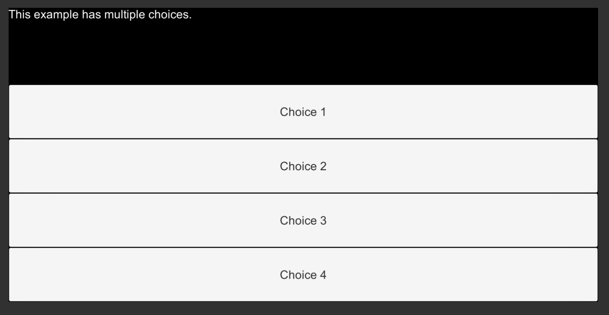
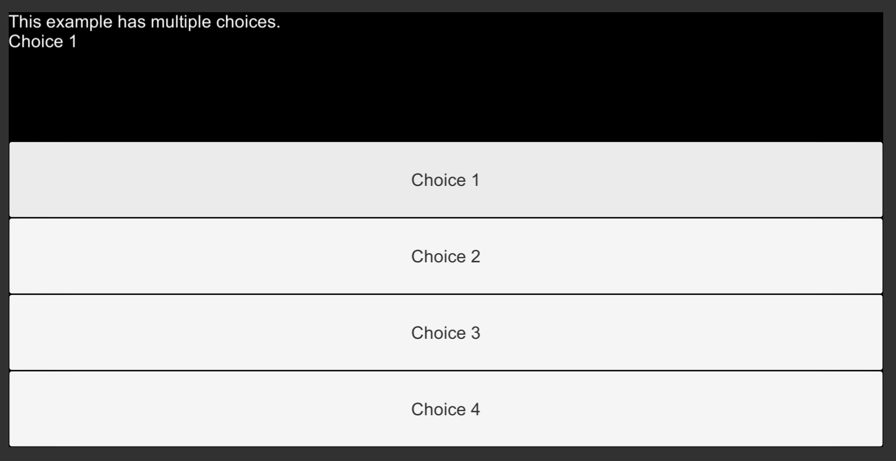
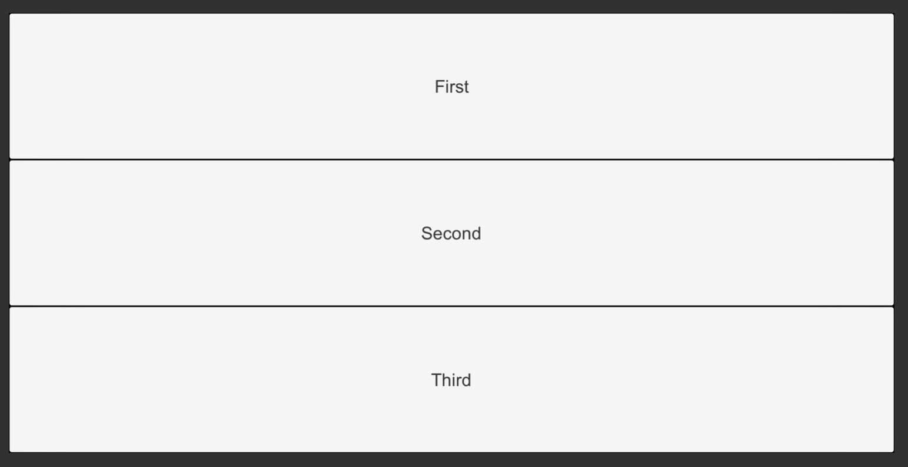

# Chapter 12: Unity UI: User Events and Dynamic Story Loading

- [Chapter 12: Unity UI: User Events and Dynamic Story Loading](#chapter-12-unity-ui-user-events-and-dynamic-story-loading)
  - [User Events](#user-events)
    - [Adding Event Listeners](#adding-event-listeners)
    - [Choosing Choices](#choosing-choices)
  - [Refreshing User Interfaces](#refreshing-user-interfaces)
    - [Destroying Buttons](#destroying-buttons)
    - [Creating Text](#creating-text)

---

## User Events

All user interface GameObjects have access to user events. In fact, in a previous chapter when a **Canvas** GameObject was added to the Scene, an additional GameObject, **Event System**, was added to the Scene. This provides access to user events and helps in responding to them internally.

Like GameObjects have access to the methods **Start()** and **Update()**, user interface GameObjects have access to different user event properties. For a [Button](https://docs.unity3d.com/Packages/com.unity.ugui@1.0/manual/script-Button.html), the event is *OnClick*. If a method is used with this property, it will be called when the user clicks the button.


In the Inspector window of a **Button** is an area named "On Click ()" and lists all methods that are called when the user event happens to the **Button**.

However, as was changed in the last chapter, the **Button** is a Prefab and is created dynamically as part of the code that was added at the end of the last chapter.

```CSharp
// For each choice in currentChoices, set its values to the new variable 'choice'
foreach (Choice choice in exampleStory.currentChoices)
{
    // Create a new GameObject based on a Prefab and set its parent to this.transform
    Button choiceButton = Instantiate(ButtonPrefab, this.transform);

    // From choiceButton, look in its children for a component of the type "Text".
    // Return a reference to this component and save it locally.
    Text choiceText = choiceButton.GetComponentInChildren<Text>();

    // Set the button's text to the choice's text
    choiceText.text = choice.text;
}
```

### Adding Event Listeners

In Unity terminology, an *event listener* is a method or other section of code that "listens" for an event and then acts in some way. Event listeners are *added* to an event so that they are called when the event happens.

The method [**AddListener()**](https://docs.unity3d.com/ScriptReference/Events.UnityEvent.AddListener.html) is available on all objects that inherit from the object [**UnityEvent**](https://docs.unity3d.com/ScriptReference/Events.UnityEvent.html). The property of all **Buttons**, *onClick*, is an **UnityEvent**, which means it has access to this method.

```CSharp
// Create a new GameObject based on a Prefab and set its parent to this.transform
Button choiceButton = Instantiate(ButtonPrefab, this.transform);

choiceButton.onClick.AddListener();
```

The method **AddListener()** accepts the parameter of a data type called **UnityAction**. This is a special object that allows for concentrating methods into a list and then calling them in sequence when an event happens.

Internally, all **UnityAction** objects are *delegates*. In C\#, a [`delegate`](https://docs.microsoft.com/en-us/dotnet/csharp/programming-guide/delegates/) is a special keyword that allows for passing in a method *as a parameter*. In other words, instead of passing a value to a method, another method is passed to it instead.

However, in using `delegate`, there is an important requirement to remember: using a `delegate` means the method cannot have a return type. Any method used with the keyword returns a `delegate`. This allows for methods to be chained, but also, in practice, means methods used with the keyword return `void`.

In C\#, a method cannot be defined inside of another method. This means that a method needs to be added to the **NewBehaviourScript** object and *delegated* to the **AddListener()** method to be called when the event happens.

```CSharp
void ButtonClickListener()
{
  Debug.Log("Testing");
}
```

In the above method **ButtonClickListener()**, its internal code will call **Debug.Log()** and write the word "Testing" in the Console window. This will serve as evidence tha the method is being called corrected.

With the use of `delegate`, the new code inside of the choice-parsing loop will call the new method **ButtonClickListener()**.

```CSharp
// For each choice in currentChoices, set its values to the new variable 'choice'
foreach (Choice choice in exampleStory.currentChoices)
{
    // Create a new GameObject based on a Prefab and set its parent to this.transform
    Button choiceButton = Instantiate(ButtonPrefab, this.transform);

    // Add a delegate as an event listener
    choiceButton.onClick.AddListener(delegate {

      // Call the method ButtonClickListener()
      ButtonClickListener();

    });

    // From choiceButton, look in its children for a component of the type "Text".
    // Return a reference to this component and save it locally.
    Text choiceText = choiceButton.GetComponentInChildren<Text>();

    // Set the button's text to the choice's text
    choiceText.text = choice.text;
}
```

Put together with the code from the last chapter, it is the following:

```CSharp
using System.Collections;
using System.Collections.Generic;
using UnityEngine;
// Add the Ink Runtime
using Ink.Runtime;
// Add Unity UI
using UnityEngine.UI;

public class NewBehaviourScript : MonoBehaviour
{
    // Add a TextAsset representing the compiled Ink Asset
    public TextAsset InkJSONAsset;

    // Add a Button representing the ButtonPrefab
    public Button ButtonPrefab;

    // Start is called before the first frame update
    void Start()
    {
        // Create a new Story object using the compiled (JSON) Ink story text
        Story exampleStory = new Story(InkJSONAsset.text);

        // From this GameObject, look in its children for a component of the type "Text".
        // Return a reference to this component and save it locally.
        Text childText = GetComponentInChildren<Text>();

        // Reset the existing text of "New Text" to an empty string
        childText.text = "";

        // Each loop, check if there is more story to load
        while (exampleStory.canContinue)
        {
            // Load the next story chunk and return the current text
            string currentTextChunk = exampleStory.Continue();

            // Get any tags loaded in the current story chunk
            List<string> currentTags = exampleStory.currentTags;

            // Create a blank line of dialogue
            string line = "";

            // For each tag in currentTag, set its values to the new variable 'tag'
            foreach (string tag in currentTags)
            {
                // Concatenate the tag and a colon
                line += tag + ": ";
            }

            // Concatenate the current text chunk
            // (This will either have a tag before it or be by itself.)
            line += currentTextChunk;

            // Concatenate the content of 'line' to the existing text
            childText.text += line;

            // For each choice in currentChoices, set its values to the new variable 'choice'
            foreach (Choice choice in exampleStory.currentChoices)
            {
                // Create a new GameObject based on a Prefab and set its parent to this.transform
                Button choiceButton = Instantiate(ButtonPrefab, this.transform);

                // Add a delegate as an event listener
                choiceButton.onClick.AddListener(delegate {

                    // Call the method ButtonClickListener()
                    ButtonClickListener();

                });

                // From choiceButton, look in its children for a component of the type "Text".
                // Return a reference to this component and save it locally.
                Text choiceText = choiceButton.GetComponentInChildren<Text>();

                // Set the button's text to the choice's text
                choiceText.text = choice.text;
            }

        }
    }

    void ButtonClickListener()
    {
        Debug.Log("Testing");
    }
}
```


When any of the generated **Button** GameObjects are clicked, the method **ButtonClickListener()** is called. This produces the **string** value "Testing" in the Console window.

### Choosing Choices

In a previous chapter, the Ink Story API method **ChooseChoiceIndex()** was introduced. When given an **Choice** *index* within the current set of choice, it will branch the story to that point.

Building from the previous code, a new method **ButtonClickListener()** was added. This was used in connection with **Debug.Log()** to show how a `delegate` could call a method (that called a method). This testing method is no longer needed. Instead, the method **ChooseChoiceIndex()** can be called from inside of the `delegate` itself.

There is now a problem. **ChooseChoiceIndex()** needs an *index* value. To fix this, the current **Choice** *index* can be passed to it.

```CSharp
// Add a delegate as an event listener
choiceButton.onClick.AddListener(delegate {

  // Call the method ChooseChoiceIndex() with the current choice index
  exampleStory.ChooseChoiceIndex(choice.index);

});
```

While valid, the new code will also eventually produce a problem. A **Button** can be clicked, and the Ink story will branch, but there is no evidence the change has happened.

The current story will be loaded up to the first set of choices. These will, in turn, be parsed and new **Button** GameObjects created. Each will have its own `delegate` tied to its index and allowing a user to click it and branch the story. However, there is no evidence this happens. The **Text** does not update!

## Refreshing User Interfaces

In the current code, there is no way to signal that a new chunk of the Ink story should be loaded based on a branching event. Things are loaded and, if there are choices, **Buttons** are created. There needs to be a way to refresh the **Text** and **Buttons**.

As there is now a need for a section of code that will be used in different places, it is time to create a new method, **Refresh()**, in the **NewBehaviourScript** class. Its purpose will be to load the next story chunk, updating the **Text**, and creating any **Buttons** as needed.

In fact, all of the outer loop, `while()` code, can be cut and pasted into this new method.

```CSharp
void Refresh()
{
  // Each loop, check if there is more story to load
  while (exampleStory.canContinue)
  {
    // Load the next story chunk and return the current text
    string currentTextChunk = exampleStory.Continue();

    // Get any tags loaded in the current story chunk
    List<string> currentTags = exampleStory.currentTags;

    // Create a blank line of dialogue
    string line = "";

    // For each tag in currentTag, set its values to the new variable 'tag'
    foreach (string tag in currentTags)
    {
      // Concatenate the tag and a colon
      line += tag + ": ";
    }

    // Concatenate the current text chunk
    // (This will either have a tag before it or be by itself.)
    line += currentTextChunk;

    // Concatenate the content of 'line' to the existing text
    childText.text += line;

    // For each choice in currentChoices, set its values to the new variable 'choice'
    foreach (Choice choice in exampleStory.currentChoices)
    {
      // Create a new GameObject based on a Prefab and set its parent to this.transform
      Button choiceButton = Instantiate(ButtonPrefab, this.transform);

      // Add a delegate as an event listener
      choiceButton.onClick.AddListener(delegate {

        // Call the method ChooseChoiceIndex() with the current choice index
        exampleStory.ChooseChoiceIndex(choice.index);

      });

      // From choiceButton, look in its children for a component of the type "Text".
      // Return a reference to this component and save it locally.
      Text choiceText = choiceButton.GetComponentInChildren<Text>();

      // Set the button's text to the choice's text
      choiceText.text = choice.text;
    }

  }
}
```

However, in trying to run the new code, a new issue appears. The object **exampleStory** does not exist inside of the context of **Refresh()**. After all, it appears *before* the outer loop and its definition was not copied over.

While it may make sense to just copy the line into **Refresh()**, its purpose is to "refresh", not reload the story. Instead, to fix this issue, the object **exampleStory** needs to become a private property of the **NewBehaviourScript** class. This would change its *scope* (level of access) and allow both the **Start()** and newer **Refresh()** methods access to it.

This is an easy change.

```CSharp
public class NewBehaviourScript : MonoBehaviour
{
    // Add a TextAsset representing the compiled Ink Asset
    public TextAsset InkJSONAsset;

    // Add a Button representing the ButtonPrefab
    public Button ButtonPrefab;

    // Add a Story
    private Story exampleStory;

    //...
}
```

Following this change, another develops. The object **childText** does not exist in the method **Refresh()**. It is created in the **Start()** method.

This can be fixed in the same way as **exampleStory** was. It can be added as a private property of the class.

```CSharp
public class NewBehaviourScript : MonoBehaviour
{
    // Add a TextAsset representing the compiled Ink Asset
    public TextAsset InkJSONAsset;

    // Add a Button representing the ButtonPrefab
    public Button ButtonPrefab;

    // Add a Story
    private Story exampleStory;

    // Add a Text
    private Text childText;
}
```

Now, with the new method **Refresh()** and the two new private properties, one final change is needed. The method **Refresh()** needs to be called from **Start()**.

```CSharp
// Start is called before the first frame update
void Start()
{
  // Create a new Story object using the compiled (JSON) Ink story text
  exampleStory = new Story(InkJSONAsset.text);

  // From this GameObject, look in its children for a component of the type "Text".
  // Return a reference to this component and save it locally.
  childText = GetComponentInChildren<Text>();

  // Reset the existing text of "New Text" to an empty string
  childText.text = "";

  // Load the story for the first time
  Refresh();
}
```

Now, running the Scene will produce the same outcome it did before.



The Ink story will be loaded and its text and choices will be parsed. However, clicking on a button more than once will cause an error: "choice out of range."

This is happening because the content of the **Canvas** is not being updated. The method **Refresh()** needs to be called after a choice is made.

```CSharp
// Add a delegate as an event listener
choiceButton.onClick.AddListener(delegate {

  // Call the method ChooseChoiceIndex() with the current choice index
  exampleStory.ChooseChoiceIndex(choice.index);

  // Refresh the text and choices
  Refresh();

});
```

Running the Scene with this change shows that the initial text of "This example has multiple choices." is shown along with the text of any choice when clicked.



However, the issue still remains. Clicking a button multiple time produces an error: "choice out of range." The problem this time is not with refreshing the text content. That now works. The issue is with the buttons. After being clicked, they should not still exist. Once used, they should be destroyed.

### Destroying Buttons

In Unity, all of the children of a parent GameObject are part of its *transform*. One way to access them, therefore, is to iterate over them using a `foreach()` statement.

```CSharp
// For each Transform object in transform, set its values to the new variable 'child'
foreach (Transform child in transform)
{
}
```

The method **Destroy()**, like **Instantiate()**, is available to all GameObjects. However, instead of creating new GameObjects like **Instantiate()**, the method **Destroy()** removes them from the Scene.

Each **Transform** object also has access to a property *gameObject* that is the GameObject it is attached to.

Using these two bits of information, the method **Destroy()** can be called to remove a GameObject via an existing **Transform** object through referring to its *gameObject* property.

```CSharp
// For each Transform object in transform, set its values to the new variable 'child'
foreach (Transform child in transform)
{
  // Destroy the GameObject associated with the transform
  Destroy(child.gameObject);
}
```

Placing this new code inside of the `delegate`, the operations are now to make a choice, remove the current children of the **Canvas**, and then load the next part of the Story.

**NewBehaviourScript.cs:**

```CSharp
using System.Collections;
using System.Collections.Generic;
using UnityEngine;
// Add the Ink Runtime
using Ink.Runtime;
// Add Unity UI
using UnityEngine.UI;

public class NewBehaviourScript : MonoBehaviour
{
    // Add a TextAsset representing the compiled Ink Asset
    public TextAsset InkJSONAsset;

    // Add a Button representing the ButtonPrefab
    public Button ButtonPrefab;

    // Add a Story
    private Story exampleStory;

    // Add a Text
    private Text childText;

    // Start is called before the first frame update
    void Start()
    {
        // Create a new Story object using the compiled (JSON) Ink story text
        exampleStory = new Story(InkJSONAsset.text);

        // From this GameObject, look in its children for a component of the type "Text".
        // Return a reference to this component and save it locally.
        childText = GetComponentInChildren<Text>();

        // Reset the existing text of "New Text" to an empty string
        childText.text = "";

        // Load the story for the first time
        Refresh();
    }

    void Refresh()
    {
        // Each loop, check if there is more story to load
        while (exampleStory.canContinue)
        {
            // Load the next story chunk and return the current text
            string currentTextChunk = exampleStory.Continue();

            // Get any tags loaded in the current story chunk
            List<string> currentTags = exampleStory.currentTags;

            // Create a blank line of dialogue
            string line = "";

            // For each tag in currentTag, set its values to the new variable 'tag'
            foreach (string tag in currentTags)
            {
                // Concatenate the tag and a colon
                line += tag + ": ";
            }

            // Concatenate the current text chunk
            // (This will either have a tag before it or be by itself.)
            line += currentTextChunk;

            // Concatenate the content of 'line' to the existing text
            childText.text += line;

            // For each choice in currentChoices, set its values to the new variable 'choice'
            foreach (Choice choice in exampleStory.currentChoices)
            {
                // Create a new GameObject based on a Prefab and set its parent to this.transform
                Button choiceButton = Instantiate(ButtonPrefab, this.transform);

                // Add a delegate as an event listener
                choiceButton.onClick.AddListener(delegate {

                    // Call the method ChooseChoiceIndex() with the current choice index
                    exampleStory.ChooseChoiceIndex(choice.index);

                    // For each Transform object in transform, set its values to the new variable 'child'
                    foreach (Transform child in transform)
                    {
                        // Destroy the GameObject associated with the transform
                        Destroy(child.gameObject);
                    }

                    // Refresh the text and choices
                    Refresh();

                });

                // From choiceButton, look in its children for a component of the type "Text".
                // Return a reference to this component and save it locally.
                Text choiceText = choiceButton.GetComponentInChildren<Text>();

                // Set the button's text to the choice's text
                choiceText.text = choice.text;
            }

        }
    }
}
```

When run and a choice made (through clicking on a button) does just that. The **Canvas** is cleared after the user clicks on a **Button**.


Currently, however, there is no more story to load in the Ink file. That can be fixed through adding more to load.

**New Ink.ink:**

```ink
This example has four choices.

* Choice 1
* Choice 2
* Choice 3
* Choice 4
-

This example has three choices

* First
* Second
* Third
-

This example has two choices

* 1st
* 2nd
-
```

With more story to load, the new code will load the next part of the story after a choice is made.



This time, the code only seems to load the choices and not the text. Internally, however, the text is being loaded, it is just that the code no longer has access to **Text**. It was destroyed along with all of the other children.

### Creating Text

TODO
