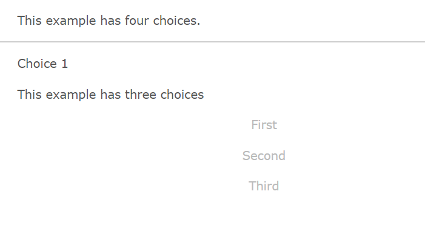
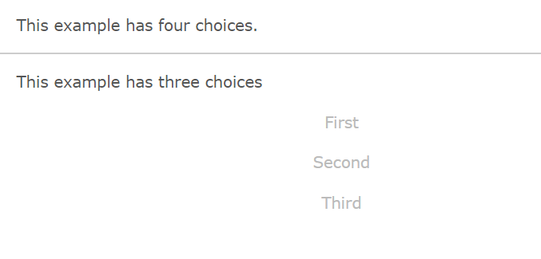
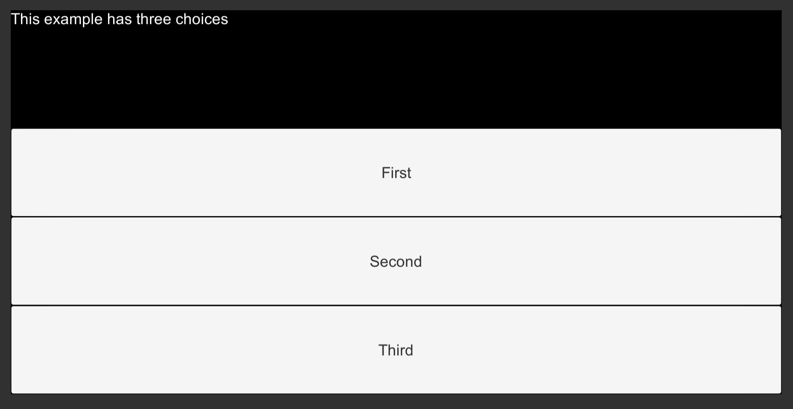

# Chapter 13: Ink: Selective Output and Story Organization

- [Chapter 13: Ink: Selective Output and Story Organization](#chapter-13-ink-selective-output-and-story-organization)
  - [Selective Output](#selective-output)
  - [Story Organization](#story-organization)

---

## Selective Output

In all previous Ink story examples in this book, choices appeared like the following:

```ink
This example has four choices.

* Choice 1
* Choice 2
* Choice 3
* Choice 4
```

When run, the Scene would show the text "This example has four choices." and then that of the choices. When one of the options was chosen, it would then appear as part of the next chunk of the story.



As running the code in Inky shows, this is the default behavior for choices. Once chosen, its text is carried over into the next story chunk.

In Ink, this behavior can be changed through special syntax called *selective output*. When any part, including the whole text, of a choice is enclosed in opening, `[`, and closing, `]`, brackets, it becomes *selective output*. That is, it is not used as part of the next story chunk.

```ink
This example has four choices.

* [Choice 1]
* [Choice 2]
* [Choice 3]
* [Choice 4]
-
```



Shown when run in Inky, no text of the choices is carried over.



When run in Unity, this shows the same effect. Through using selective output (putting opening and closing square brackets around the text), the text of the choice is not passed to the next story chunk.

## Story Organization
