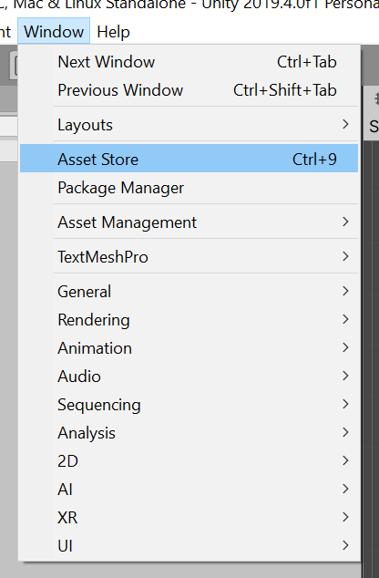
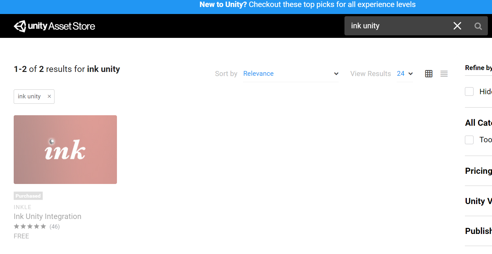
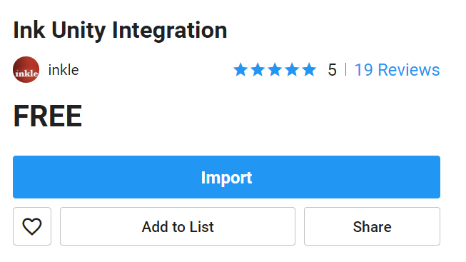
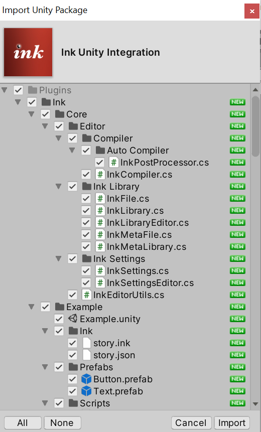
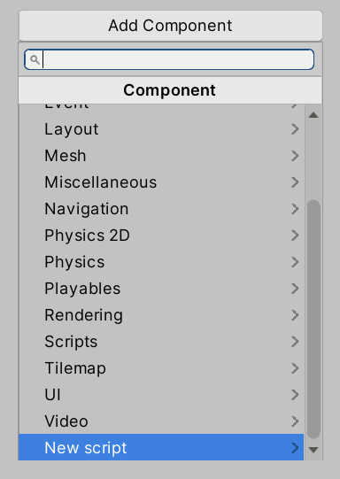

# Chapter 7: Ink: Loading Ink-Unity Plugin

- [Chapter 7: Ink: Loading Ink-Unity Plugin](#chapter-7-ink-loading-ink-unity-plugin)
  - [Accessing and Importing Ink Unity Integration](#accessing-and-importing-ink-unity-integration)
  - [Creating Example Scripting Component](#creating-example-scripting-component)
  - [Loading a Compiled Ink File](#loading-a-compiled-ink-file)
  - [Running an Example Ink Story](#running-an-example-ink-story)

---

## Accessing and Importing Ink Unity Integration

Open Unity or Unity Hub and create a new project. (This project is for testing purposes. Its name can be whatever is most convenient including the default "New Unity Project".)



Go to Window -> Asset Store.



In the Asset Store view, click on the search box and type "Ink Unity".

Once the search finishes, click on "Ink Unity Integration" by Inkle.



As "Ink Unity Integration" is a free Asset, click on "Download" and then "Import".



Once the Asset has downloaded and loaded itself, a new Import Unity Package window will open.

Click on "All" to make sure all of the file are selected and them "Import".

Once loaded, the Ink Compiler, Run-Time, and Example will be added to the current project.

## Creating Example Scripting Component

In the Hierarchy Window, click on the Main Camera GameObject. This will show its components in the Inspector Window.

> **Note:** In the default layout, the Hierarchy Window will be on the far left and the Inspector Window on the far right.



In the Inspector Window, click on "Add Component" and scroll to "Add Script".


Click on "Add Script" and then the "Create and Add Script" button.

> **Note:** Normally, the default name of "NewBehaviorScript" would be changed. However, as this is an example, that step is being skipped.


Whenever a new scripting component is added, its C\# file is added to the Assets folder. With the Ink Unity Integration plugin installed, it will be the newest file.

Double-click this file to open it in Visual Studio.

```CSharp
using System.Collections;
using System.Collections.Generic;
using UnityEngine;

public class NewBehaviourScript : MonoBehaviour
{
    // Start is called before the first frame update
    void Start()
    {
    }

    // Update is called once per frame
    void Update()
    {
    }
}
```

As reviewed in [Chapter 5 on Scripting Basics](../chapter5/index.md), a new behavior script will have two methods: **Start()** and **Update()**. The method **Start()** will be called before the first rendered frame and the method **Update()** will be called every frame.

In order to use Ink and its Runtime classes, it needs to be added to the file.

```CSharp
using System.Collections;
using System.Collections.Generic;
using UnityEngine;
// Add the Ink Runtime
using Ink.Runtime;

public class NewBehaviourScript : MonoBehaviour
{
    // Start is called before the first frame update
    void Start()
    {
    }

    // Update is called once per frame
    void Update()
    {
    }
}
```

Ink runs *compiled* files created by Inky or the Ink compiler now added to the project. However, before it can run a file, there needs to be a property added to the file so that it can be used in the Unity Editor.

> **Reminder:** All (public) properties added to script file can be accessed and its values changes in the Unity Editor.

TODO

## Loading a Compiled Ink File

## Running an Example Ink Story
