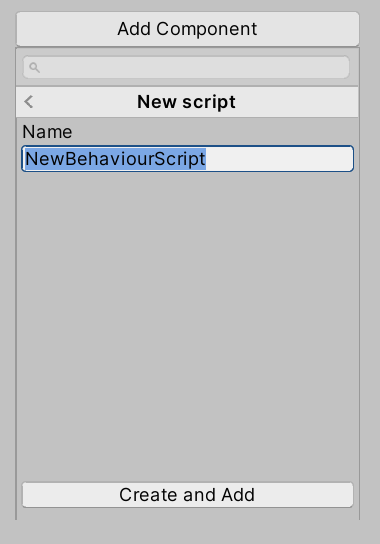
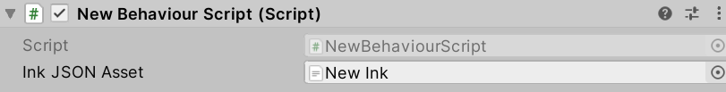

# Chapter 7: Ink: Loading Ink-Unity Plugin

- [Chapter 7: Ink: Loading Ink-Unity Plugin](#chapter-7-ink-loading-ink-unity-plugin)
  - [Accessing and Importing Ink Unity Integration](#accessing-and-importing-ink-unity-integration)
  - [Creating Example Scripting Component](#creating-example-scripting-component)
  - [Loading a Compiled Ink File](#loading-a-compiled-ink-file)
  - [Editing the Ink File](#editing-the-ink-file)
  - [Setting up Story API](#setting-up-story-api)

---

## Accessing and Importing Ink Unity Integration

Open Unity or Unity Hub and create a new project. (This project is for testing purposes. Its name can be whatever is most convenient including the default "New Unity Project".)


Go to Window -> Asset Store.


In the Asset Store view, click on the search box and type "Ink Unity".

Once the search finishes, click on "Ink Unity Integration" by Inkle.


As "Ink Unity Integration" is a free Asset, click on "Download" and then "Import".


Once the Asset has downloaded and loaded itself, a new Import Unity Package window will open.

Click on "All" to make sure all of the file are selected and them "Import".

Once loaded, the Ink Compiler, Run-Time, and Example will be added to the current project.

## Creating Example Scripting Component

In the Hierarchy Window, click on the Main Camera GameObject. This will show its components in the Inspector Window.

> **Note:** In the default layout, the Hierarchy Window will be on the far left and the Inspector Window on the far right.


In the Inspector Window, click on "Add Component" and scroll to "Add Script".



Click on "Add Script" and then the "Create and Add Script" button.

> **Note:** Normally, the default name of "NewBehaviorScript" would be changed. However, as this is an example, that step is being skipped.


Whenever a new scripting component is added, its C\# file is added to the Assets folder. With the Ink Unity Integration plugin installed, it will be the newest file.

Double-click this file to open it in Visual Studio.

```CSharp
using System.Collections;
using System.Collections.Generic;
using UnityEngine;

public class NewBehaviourScript : MonoBehaviour
{
    // Start is called before the first frame update
    void Start()
    {
    }

    // Update is called once per frame
    void Update()
    {
    }
}
```

As reviewed in [Chapter 5 on Scripting Basics](../chapter5/index.md), a new behavior script will have two methods: **Start()** and **Update()**. The method **Start()** will be called before the first rendered frame and the method **Update()** will be called every frame.

In order to use Ink and its Runtime classes, it needs to be added to the file.

```CSharp
using System.Collections;
using System.Collections.Generic;
using UnityEngine;
// Add the Ink Runtime
using Ink.Runtime;

public class NewBehaviourScript : MonoBehaviour
{
    // Start is called before the first frame update
    void Start()
    {
    }

    // Update is called once per frame
    void Update()
    {
    }
}
```

## Loading a Compiled Ink File

Ink runs *compiled* files created by Inky or the Ink compiler now added to the project. However, before it can run a file, there needs to be a property added to the file so that it can be used in the Unity Editor.

> **Reminder:** All (public) properties added to script file can be accessed and its values changes in the Unity Editor.

```CSharp
using System.Collections;
using System.Collections.Generic;
using UnityEngine;
// Add the Ink Runtime
using Ink.Runtime;

public class NewBehaviourScript : MonoBehaviour
{
    // Add a TextAsset representing the compiled Ink Asset
    public TextAsset InkJSONAsset;

    // Start is called before the first frame update
    void Start()
    {
    }

    // Update is called once per frame
    void Update()
    {
    }
}
```

Adding the property **InkJSONAsset** of type **[TextAsset](https://docs.unity3d.com/Manual/class-TextAsset.html)** helps in connecting the text asset from the Project window with the property during the Initialization step of the order of execution for the GameObject.


With the Ink Unity Integration plugin loaded, any `.ink` files added to the project will be automatically compiled into `.json` files. The context menu for the Project window also now has a "Ink Script" option for creating Ink files quickly.


To create a Ink Script file using this functionality, use the Add or right-click menu and then click on "Ink Script".


A new file named `New Ink.ink` will be created. After clicking outside of the name, the built-in Ink compiler will automatically produce a new file `New Ink.json`. It is this file that should be associated with the behavior script.



With Main Camera selected in the Hierarchy window (so that its components appear in the Inspector window), drag and drop the new `New Ink.json` file on the "Ink JSON Asset" property.

With the `New Ink.json` file now associated with the scripting component, any saved changes to the `New Ink.ink` file will result in the JSON file being re-compiled. As it is now associated with the scripting component, its content will always be updated.

## Editing the Ink File

Unless otherwise setup, `.ink` files are not associated with a program for editing. Double-clicking or clicking the "Open" button in the Inspector window will prompt to pick a program to edit in Windows.

It is strongly recommended to use the [Inky](https://www.inklestudios.com/ink/) editor for editing `.ink` files. However, Notepad (in Windows) or any other plain text editors can be used.

> **Note:** This chapter will use screenshots from Inky.


**New Ink.ink:**

```ink
Hey, there!
```


Adding the text `Hey, there!` in the left-hand side of Inky will show the compiled results on the right-hand side.

Once added, save the file through using Ctrl-S or using File -> Save.

Returning to Unity will trigger the Project window to check for any changes in any existing Ink files. If they have changed, the built-in Ink compiler will re-compile and produce an updated JSON file.

> **Reminder:** Because the JSON file is associated with "Ink JSON Asset" property, it was also always be updated when the scene runs.

## Setting up Story API

With the Ink and compiled JSON setup, the compiled file will be used when the scene starts. However, even with the compiled file associated, one more step is needed. A **Story** object is needed.

```CSharp
using System.Collections;
using System.Collections.Generic;
using UnityEngine;
// Add the Ink Runtime
using Ink.Runtime;

public class NewBehaviourScript : MonoBehaviour
{
    // Add a TextAsset representing the compiled Ink Asset
    public TextAsset InkJSONAsset;

    // Start is called before the first frame update
    void Start()
    {
        Story exampleStory = new Story(InkJSONAsset.text);
        Debug.Log(exampleStory.Continue());
    }

    // Update is called once per frame
    void Update()
    {
    }
}
```

The **Story** object allows for using the Story API. It exposes methods like **Continue()** that load parts of the story.

In the above example, a new **Story** object is created and is passed the **InkJSONAsset** property that is associated with the `New Ink.json` via Unity during its Initialization step.

> **Note:** The property *text* is used from the **TextAsset** object. This exposes the text content of the associated text asset file.

When run, the code will start with the property during the Initialization order of execution.

Next, the method **Start()** is called on the GameObject.

A **Story** object is then created and its constructor method is passed the *InkJSONAsset.text* property of the **InkJSONAsset** object.

Finally, inside of the **Start()** method, **Debug.Log()** is called with the argument **exampleStory.Continue()**.


As will be covered in the next chapter, the Story API has methods for loading content from a story (compiled JSON file). The method **Continue()** loads the next chunk in the story. In this example, it will load the current text of the story (`Hey, there!`) and display it on the Console.
