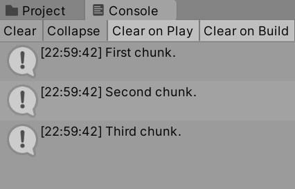
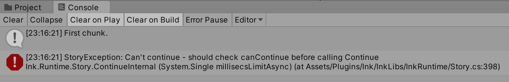
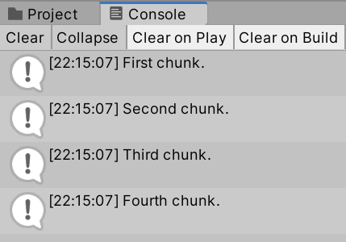
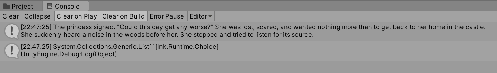
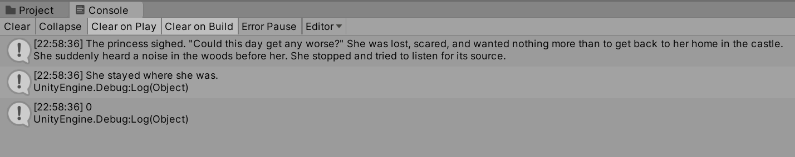
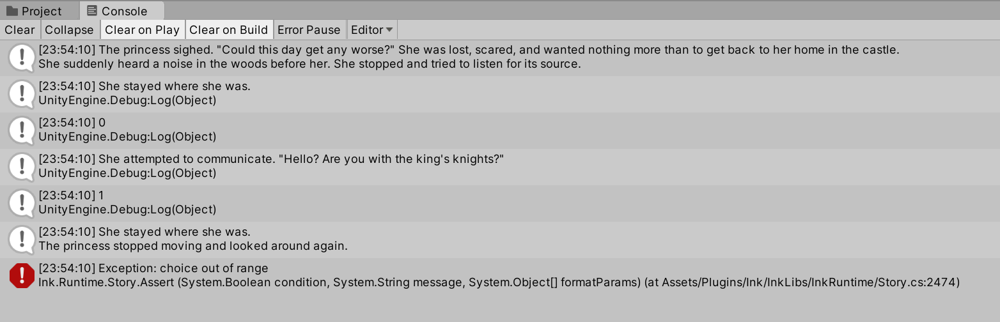

# Chapter 8: Ink: Introducing Story API

- [Chapter 8: Ink: Introducing Story API](#chapter-8-ink-introducing-story-api)
  - [Loading Story Chunks](#loading-story-chunks)
    - [**Continue()**](#continue)
    - [**ContinueMaximally()**](#continuemaximally)
    - [End of Story](#end-of-story)
    - [*canContinue*](#cancontinue)
  - [Loading Choices](#loading-choices)
    - [*currentChoices*](#currentchoices)
    - [**Choice** Objects](#choice-objects)
    - [The *canContinue*-**ContinueMaximally()**-*currentChoices* Pattern](#the-cancontinue-continuemaximally-currentchoices-pattern)
    - [Making Choices](#making-choices)
      - [**ChooseChoiceIndex()**](#choosechoiceindex)
      - [Choice Out of Range Error](#choice-out-of-range-error)
  - [Loading Tags](#loading-tags)

---

## Loading Story Chunks

There are two methods for loading the next part of the story: **Continue()** and **ContinueMaximally()**. Using this methods are also affected by End of Story and the *canContinue* property of the Story API.

### **Continue()**

The method **Continue()** will load the next story chunk from the current point until the next newline character in the story. In other words, it will load a "paragraph" until there is a line between what it loaded and the next part of the story.

**New Ink.ink:**

```ink
First chunk.

Second chunk.

Third chunk.
```

**NewBehaviourScript.cs:**

```CSharp
using System.Collections;
using System.Collections.Generic;
using UnityEngine;
// Add the Ink Runtime
using Ink.Runtime;

public class NewBehaviourScript : MonoBehaviour
{
    // Add a TextAsset representing the compiled Ink Asset
    public TextAsset InkJSONAsset;

    // Start is called before the first frame update
    void Start()
    {
        // Create a new Story object using the compiled (JSON) Ink story text
        Story exampleStory = new Story(InkJSONAsset.text);

        Debug.Log(exampleStory.Continue());

        Debug.Log(exampleStory.Continue());

        Debug.Log(exampleStory.Continue());
    }

    // Update is called once per frame
    void Update()
    {
    }
}
```



In the above code example, the repeated uses of the **Continue()** method will load the story. The Console window will show "First chunk.", "Second chunk.", and then "Third chunk.".

### **ContinueMaximally()**

The **ContinueMaximally()** method will load all text content until it encounters a set of choices or the end of the story.

**New Ink.ink:**

```ink
First chunk.

Second chunk.

Third chunk.
```

**NewBehaviourScript.cs:**

```CSharp
using System.Collections;
using System.Collections.Generic;
using UnityEngine;
// Add the Ink Runtime
using Ink.Runtime;

public class NewBehaviourScript : MonoBehaviour
{
    // Add a TextAsset representing the compiled Ink Asset
    public TextAsset InkJSONAsset;

    // Start is called before the first frame update
    void Start()
    {
        // Create a new Story object using the compiled (JSON) Ink story text
        Story exampleStory = new Story(InkJSONAsset.text);

        Debug.Log(exampleStory.ContinueMaximally());

        Debug.Log(exampleStory.ContinueMaximally());

    }

    // Update is called once per frame
    void Update()
    {

    }
}
```

 Console")

In the above code, the text "First chunk. / Second chunk." will be loaded first. With the second call to **ContinueMaximally()**, the End of the Story will be encountered.

### End of Story

Attempting to load story content after a story has ended will result in an error.

**New Ink.ink:**

```ink
First chunk.
```

**NewBehaviourScript.cs:**

```CSharp
using System.Collections;
using System.Collections.Generic;
using UnityEngine;
// Add the Ink Runtime
using Ink.Runtime;

public class NewBehaviourScript : MonoBehaviour
{
    // Add a TextAsset representing the compiled Ink Asset
    public TextAsset InkJSONAsset;

    // Start is called before the first frame update
    void Start()
    {
        // Create a new Story object using the compiled (JSON) Ink story text
        Story exampleStory = new Story(InkJSONAsset.text);

        Debug.Log(exampleStory.Continue());

        Debug.Log(exampleStory.Continue());
    }

    // Update is called once per frame
    void Update()
    {
    }
}
```



To help with this, the Story API provides a property named *canContinue*.

### *canContinue*

Attempting to load more story when it does not exists will produce an error. However, as this is a common problem, the Story API provides a Boolean property called *canContinue* that will always be `true` if there is more story to load.

Used as part of a looping structure, the Boolean value can be tested. As long as it is `true`, the next part of the story will be loaded.

**New Ink.ink:**

```ink
First chunk.

Second chunk.

Third chunk.

Fourth chunk.
```

**NewBehaviourScript.cs:**

```CSharp
using System.Collections;
using System.Collections.Generic;
using UnityEngine;
// Add the Ink Runtime
using Ink.Runtime;

public class NewBehaviourScript : MonoBehaviour
{
    // Add a TextAsset representing the compiled Ink Asset
    public TextAsset InkJSONAsset;

    // Start is called before the first frame update
    void Start()
    {
        // Create a new Story object using the compiled (JSON) Ink story text
        Story exampleStory = new Story(InkJSONAsset.text);

        // Each loop, check if there is more story to load
        while(exampleStory.canContinue)
        {
            // As long as there is story, show the text in the Console window
            Debug.Log(exampleStory.Continue());
        }
    }
}
```



Moving into more advanced uses of the Story API, the property *canContinue*, and looping structures using it, are foundational to creating a game loop where more story is dynamically loaded as players make choices in the story.

## Loading Choices

So far in this chapter, text has been loaded using the methods of **Continue()** and **ContinueMaximally()**. These can be helpful when working with simple stories. However, most Ink project use choices. To load those, additional properties and object types are needed.

### *currentChoices*

The property *currentChoices* of the Story API will always contain any current choices. If any choices exist within the current chunk of the loaded story, they will exist within a **List\<Choice\>** structure as provided by the Story API property.

**New Ink.ink:**

```ink
The princess sighed. "Could this day get any worse?" She was lost, scared, and wanted nothing more than to get back to her home in the castle.

She suddenly heard a noise in the woods before her. She stopped and tried to listen for its source.

* She stayed where she was.
* She attempted to communicate. "Hello? Are you with the king's knights?"
-
```

**NewBehaviourScript.cs:**

```CSharp
using System.Collections;
using System.Collections.Generic;
using UnityEngine;
// Add the Ink Runtime
using Ink.Runtime;

public class NewBehaviourScript : MonoBehaviour
{
    // Add a TextAsset representing the compiled Ink Asset
    public TextAsset InkJSONAsset;

    // Start is called before the first frame update
    void Start()
    {
        // Create a new Story object using the compiled (JSON) Ink story text
        Story exampleStory = new Story(InkJSONAsset.text);

        // Each loop, check if there is more story to load
        while(exampleStory.canContinue)
        {
            // As long as there is story, show the text in the Console window
            Debug.Log(exampleStory.ContinueMaximally());

            Debug.Log(exampleStory.currentChoices);
        }
    }
}
```



### **Choice** Objects

The *currentChoices* property is a **List\<Choice\>**. This means that each object in the **List** is of the type **Choice**.

Each **Choice** object is composed of multiple properties, but two important ones are its *text* and *index*. When loaded by the Ink Runtime, this means that every choice has access to the text shown to the player as well as its position (index) in the current collection of choices.

**New Ink.ink:**

```ink
The princess sighed. "Could this day get any worse?" She was lost, scared, and wanted nothing more than to get back to her home in the castle.

She suddenly heard a noise in the woods before her. She stopped and tried to listen for its source.

* She stayed where she was.
* She attempted to communicate. "Hello? Are you with the king's knights?"
-
```

**NewBehaviourScript.cs:**

```CSharp
using System.Collections;
using System.Collections.Generic;
using UnityEngine;
// Add the Ink Runtime
using Ink.Runtime;

public class NewBehaviourScript : MonoBehaviour
{
    // Add a TextAsset representing the compiled Ink Asset
    public TextAsset InkJSONAsset;

    // Start is called before the first frame update
    void Start()
    {
        // Create a new Story object using the compiled (JSON) Ink story text
        Story exampleStory = new Story(InkJSONAsset.text);

        // Each loop, check if there is more story to load
        while(exampleStory.canContinue)
        {
            // As long as there is story, show the text in the Console window
            Debug.Log(exampleStory.ContinueMaximally());

            // Show the first (0) choice's text
            Debug.Log(exampleStory.currentChoices[0].text);

            // Show the first (0) choice's index
            Debug.Log(exampleStory.currentChoices[0].index);
        }
    }
}
```



In the above example, the property *canContinue* is tested. If there is more story to load, the method **ContinueMaximally()** is run. Next, the *text* and *index* properties of first (0-position) choice in the *currentChoices* property are shown. These are `She stayed where she was.` and `0` as shown in the Console window.

The usages of *canContinue*, **ContinueMaximally()**, and then *currentChoices* is, in fact, very common and an important pattern for using the Ink Story API in Unity.

### The *canContinue*-**ContinueMaximally()**-*currentChoices* Pattern

Previously, the methods **ContinueMaximally()** and **Continue()** were explained as "loading the next story chunk." While they have been used as part of showing text chunks of stories with the **Debug.Log()** method, an important part of their definitions and usage fall on the word *loading* as part of that explanation. They **load** the next part of the story. As a result, they return the text chunk, but their primary focus is actually the loading of the next story chunk.

In the previous examples in this chapter, the combination of *canContinue* and then **ContinueMaximally()** and **Continue()** were key to preventing the error of attempting to load more story after it had ended. They are and should always be used in connection with each other.

Generally, then, the property *canContinue* is used first and then followed by one of the method calls to load the next part of the story. Most of the time, the method **ContinueMaximally()** is a good option because it will "load all text content until it encounters a set of choices or the end of the story." (There are important cases where **Continue()** is a better option, but they will be explained as part of working with tags later in this chapter.)

Because **ContinueMaximally()** handles the loading, the next in the pattern is using the *currentChoices* property, as it will be populated with the choices loaded by the previous loading cycle. In other words, the pattern starts with using *canContinue*, moves into loading with **ContinueMaximally()**, and then moves to working with any choices within the current story chunk with the property *currentChoices*.

In fact, as *currentChoices* is a **List\<Choice\>** this means that a second loop can be created inside of the existing use of `while(canContinue)` that uses the `foreach()` statement to iterate through the members of the **List** of **Choice** objects.

Using the previous code in this chapter as an extended example, the outer and inter-loop structure of the *canContinue*-**ContinueMaximally()**-*currentChoices* pattern would look like the following:

**NewBehaviourScript.cs:**

```CSharp
using System.Collections;
using System.Collections.Generic;
using UnityEngine;
// Add the Ink Runtime
using Ink.Runtime;

public class NewBehaviourScript : MonoBehaviour
{
    // Add a TextAsset representing the compiled Ink Asset
    public TextAsset InkJSONAsset;

    // Start is called before the first frame update
    void Start()
    {
        // Create a new Story object using the compiled (JSON) Ink story text
        Story exampleStory = new Story(InkJSONAsset.text);

        // Each loop, check if there is more story to load
        while(exampleStory.canContinue)
        {
            // Load the next story chunk and return the current text
            string currentTextChunk = exampleStory.ContinueMaximally();

            // Show the current story text in the Console window
            Debug.Log(currentTextChunk);

            // Iterate through the current choices
            // For each choice in currentChoice, set its values to the new variable 'choice'
            foreach (Choice choice in exampleStory.currentChoices)
            {
                // Show choice's text
                Debug.Log(choice.text);

                // Show choice's index
                Debug.Log(choice.index);
            }

        }
    }
}
```

-currentChoices Pattern")

### Making Choices

Loading text content and showing choices are the first step toward making an interactive project. The next is using that data to "make choices" that affect the Ink story.

As was reviewed in the previous section, each **Choice** object has two (among other) key properties: *text* and *index*. Previously, the emphasis was on the *text* property. In order to make choices using **Choice** object, their *index* becomes the focus.

#### **ChooseChoiceIndex()**

The method **ChooseChoiceIndex()** accepts a valid index from the current set of choices. When given this index, it triggers internal code to shift to that branch of the story that moves to the next loading position. This method is how "choices" are made.

**New Ink.ink:**

```ink
The princess sighed. "Could this day get any worse?" She was lost, scared, and wanted nothing more than to get back to her home in the castle.

She suddenly heard a noise in the woods before her. She stopped and tried to listen for its source.

* She stayed where she was.
    The princess stopped moving and looked around again.

* She attempted to communicate. "Hello? Are you with the king's knights?"
    At her words, the forest went silent.
-
```

**NewBehaviourScript.cs:**

```CSharp
using System.Collections;
using System.Collections.Generic;
using UnityEngine;
// Add the Ink Runtime
using Ink.Runtime;

public class NewBehaviourScript : MonoBehaviour
{
    // Add a TextAsset representing the compiled Ink Asset
    public TextAsset InkJSONAsset;

    // Start is called before the first frame update
    void Start()
    {
        // Create a new Story object using the compiled (JSON) Ink story text
        Story exampleStory = new Story(InkJSONAsset.text);

        // Each loop, check if there is more story to load
        while(exampleStory.canContinue)
        {
            // Load the next story chunk and return the current text
            string currentTextChunk = exampleStory.ContinueMaximally();

            // Show the current story text in the Console window
            Debug.Log(currentTextChunk);

            // Iterate through the current choices
            // For each choice in currentChoice, set its values to the new variable 'choice'
            foreach (Choice choice in exampleStory.currentChoices)
            {
                // Show choice's text
                Debug.Log(choice.text);

                // Show choice's index
                Debug.Log(choice.index);
            }

            // Pick the first (0) choice based on its index in the currentChoices List<Choice>
            exampleStory.ChooseChoiceIndex(0);

        }
    }
}
```



In the above code, the *canContinue*-**ContinueMaximally()**-*currentChoices* pattern is used. Following that, the method **ChooseChoiceIndex()** is used. For the first set of choices, this produces the out of the *text* of the **Choice** `She stayed where she was.` that is then followed by the method **ContinueMaximally()** loading the result of the choice `The princess stopped moving and looked around again.`

However, this produces an error on the second major loop. The exception "Choice Out of Range" is raised when the method **ChooseChoiceIndex()** is called a second time when there are no choices to "choose" from via the property *currentChoices*.

#### Choice Out of Range Error

The exception "choice out of range" is raised when the method **ChooseChoiceIndex()** attempts to "choose" a choice that is outside of the range of the current length of the *currentChoices* property.

To protect against this, there are a number of different solutions. One quick way would be to test the *Count* of the *currentChoices* property. If it is greater than 0, that would mean there is at least one **Choice** in the **List\<Choice\>** that could be "chosen."

```CSharp
using System.Collections;
using System.Collections.Generic;
using UnityEngine;
// Add the Ink Runtime
using Ink.Runtime;

public class NewBehaviourScript : MonoBehaviour
{
    // Add a TextAsset representing the compiled Ink Asset
    public TextAsset InkJSONAsset;

    // Start is called before the first frame update
    void Start()
    {
        // Create a new Story object using the compiled (JSON) Ink story text
        Story exampleStory = new Story(InkJSONAsset.text);

        // Each loop, check if there is more story to load
        while(exampleStory.canContinue)
        {
            // Load the next story chunk and return the current text
            string currentTextChunk = exampleStory.ContinueMaximally();

            // Show the current story text in the Console window
            Debug.Log(currentTextChunk);

            // Iterate through the current choices
            // For each choice in currentChoice, set its values to the new variable 'choice'
            foreach (Choice choice in exampleStory.currentChoices)
            {
                // Show choice's text
                Debug.Log(choice.text);

                // Show choice's index
                Debug.Log(choice.index);
            }

            // Is the number of choices in the List<Choice> (its Count) greater than 0?
            if(exampleStory.currentChoices.Count > 0)
            {
                // Pick the first (0) choice based on its index in the currentChoices List<Choice>
                exampleStory.ChooseChoiceIndex(0);
            }
        }
    }
}
```

TODO

## Loading Tags
