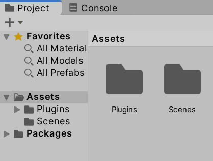
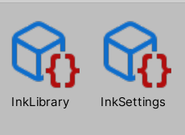
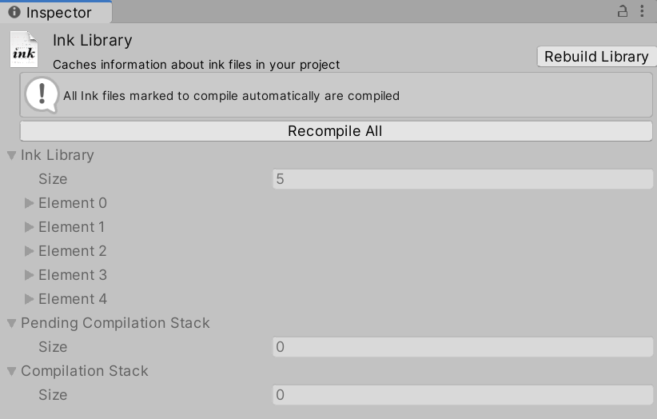
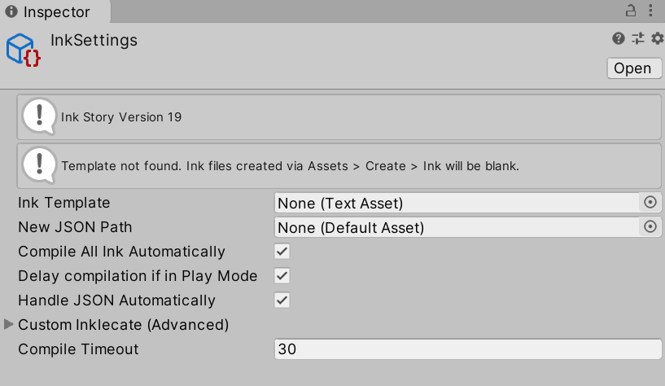
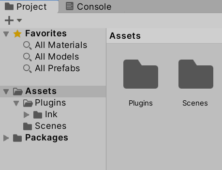
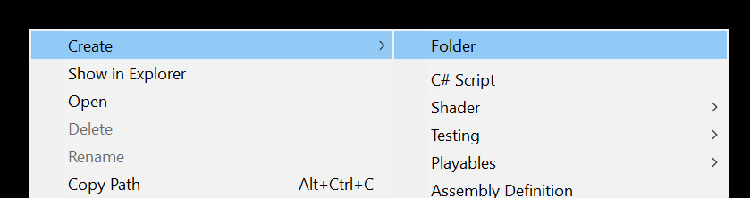
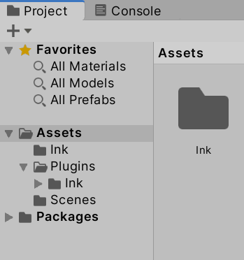
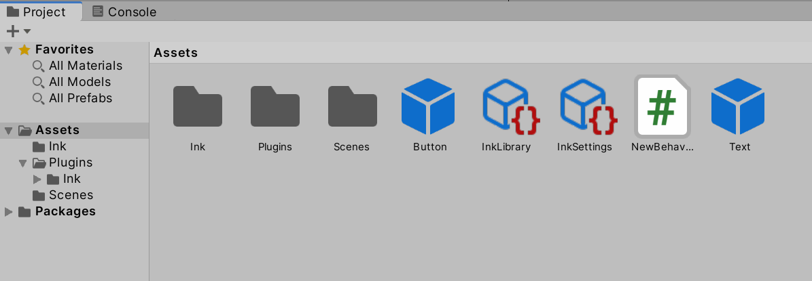
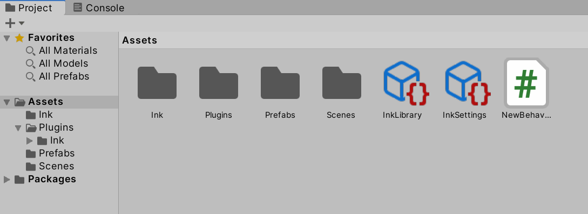
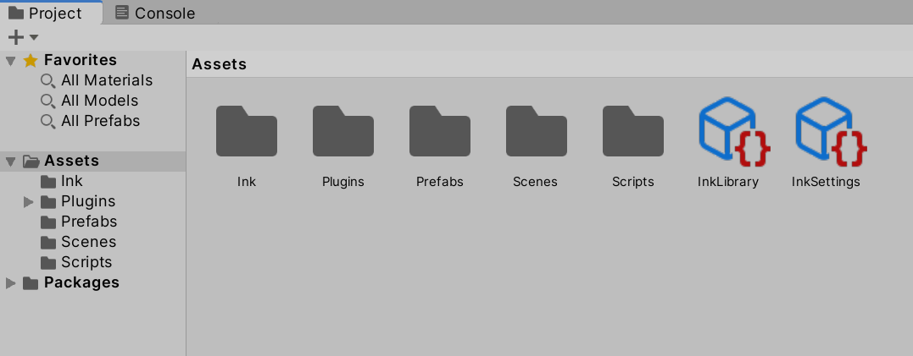

# Chapter 14: Unity: Organizing Project Files

- [Chapter 14: Unity: Organizing Project Files](#chapter-14-unity-organizing-project-files)
  - [Reviewing Project Window Defaults](#reviewing-project-window-defaults)
    - [`InkLibrary`](#inklibrary)
    - [`InkSettings`](#inksettings)
  - [Organizing Folders](#organizing-folders)
    - [Making Folders](#making-folders)

---

## Reviewing Project Window Defaults

By default, Unity creates a folder named `Scenes` and creates a scene called "SampleScene". After the Ink Unity Integration plugin is added, an additional folder named `Plugins` is also added. This contains a folder named `Ink` and its support code.

In the Project window will also be two other files, `InkLibrary` and `InkSettings`. These are used by the Ink Unity Integration to save options and keep track of which files have been compiled.

### `InkLibrary`

Clicking on the `InkLibrary` file in the Project window shows the current options along with options to "Rebuild Library" and "Recompile All" in the Inspector window.

### `InkSettings`

Clicking on the `InkSetting` file in the Project window shows additional settings for Ink files. These can be created in the form of a template, if all Ink files should be compiled automatically or not, or what the timeout should be for compiling files.

## Organizing Folders

The `Assets` folder, as shown in the left-hand side of the Project window, shows the current files in the Project window. The folders in this area can be navigated to show their contents in the Project window.

> **Note:** While the Project window shows the `Assets` folder, this is the actual directory used by the operating system to store files.

The "Favorites" area of the left-hand side shows an easy access to common asset types of materials, models, and prefabs.

### Making Folders

The use of the folder named `Scenes` and its files shows a good model to follow with organizing files in a project. Each type of file should be in its own folder.

New folders can be created through the addition menu or using the right-click and then going to Create -> Folder.

To begin to organize, one potential folder to create would be "Ink".

Once created, the existing Ink can be dragged and dropped into the new folder to organize them.

Once files have been moved, their association with existing components do not have to be changed. As long as files remain in the Project window, and within the folders it has access to, none of the associations will need to be changed.

With the Ink files organized, the next would be to organize the prefab files through creating a `Prefabs` folder and dragging and dropping the prefab files into the new folder.

Finally, the scripting files need to be organized. There is only one "script" files at the moment, but more could be added in the future. Creating a `Scripts` folder and dragging and dropping the existing file finishes the organizing.

With the files moved into separate folders, the project is now organized.
